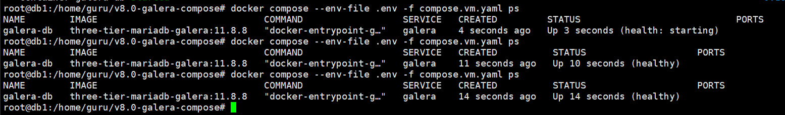
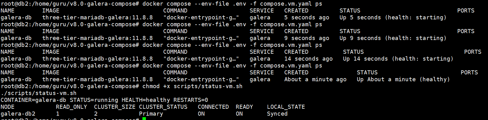
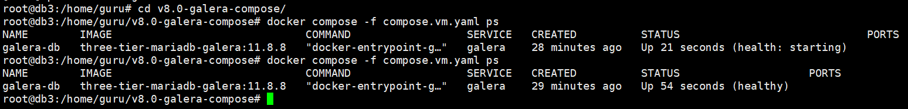

# VMware Ubuntu 24.04 LTS 3-VM Galera 검증 절차

## 결론

기존 `compose.yaml`은 한 Docker 호스트에서 컨테이너 3개를 실행하는 구성이다. VMware VM 3대에 Galera 노드를 분산하려면 `compose.vm.yaml`을 사용한다.

| VM | IP | Galera node | 정책 |
|---|---:|---|---|
| db1 | `192.168.100.30` | `galera-db1` | Writer, `read_only=OFF` |
| db2 | `192.168.100.40` | `galera-db2` | Reader, `read_only=ON` |
| db3 | `192.168.100.50` | `galera-db3` | Reader, `read_only=ON` |

## 1. 사전 점검

각 VM에서 IP와 OS 버전을 확인한다.

```bash
hostname -I
cat /etc/os-release | grep -E '^(PRETTY_NAME|VERSION_CODENAME)='
```

Docker가 없으면 각 VM에 설치한다.

```bash
sudo apt update
sudo apt install -y ca-certificates curl
sudo install -m 0755 -d /etc/apt/keyrings
sudo curl -fsSL https://download.docker.com/linux/ubuntu/gpg -o /etc/apt/keyrings/docker.asc
sudo chmod a+r /etc/apt/keyrings/docker.asc

sudo tee /etc/apt/sources.list.d/docker.sources >/dev/null <<EOF
Types: deb
URIs: https://download.docker.com/linux/ubuntu
Suites: $(. /etc/os-release && echo "${UBUNTU_CODENAME:-$VERSION_CODENAME}")
Components: stable
Architectures: $(dpkg --print-architecture)
Signed-By: /etc/apt/keyrings/docker.asc
EOF

sudo apt update
sudo apt install -y docker-ce docker-ce-cli containerd.io docker-buildx-plugin docker-compose-plugin
sudo systemctl enable --now docker
sudo usermod -aG docker "$USER"
```

SSH를 다시 접속하거나 현재 터미널에 Docker 그룹을 반영한다.

```bash
newgrp docker
```

이 문서에서 사람이 직접 입력할 수 있는 비밀번호는 Ubuntu 또는 SSH/XFTP 로그인 비밀번호뿐이다.

- `sudo ...` 명령이 `[sudo] password for guru:`를 표시하면 Ubuntu 로그인 비밀번호를 입력한다.
- `newgrp docker`가 비밀번호를 묻는 경우에도 Ubuntu 로그인 비밀번호를 입력한다.
- `scp` 또는 XFTP로 secret 파일을 복사할 때는 대상 VM의 SSH/XFTP 로그인 비밀번호를 입력할 수 있다.
- `ROOT_PASSWORD`, `APP_PASSWORD`, `SST_PASSWORD`는 직접 입력하지 않는다. 이 값들은 `secrets/*.txt` 파일에서 자동으로 읽힌다.
- `docker exec ... mariadb ... -p"$ROOT_PASSWORD"` 같은 명령에서 MariaDB가 `Enter password:`를 묻는다면 정상 흐름이 아니다. 이때는 비밀번호를 손으로 입력하지 말고 `secrets/*.txt` 파일 존재 여부, `.env`, 명령어 복사 누락을 먼저 확인한다.

Docker 동작을 확인한다.

```bash
docker --version
docker compose version
docker run --rm hello-world
```

MariaDB Server는 각 VM 호스트에 직접 설치하지 않는다. 이 구성은 `mariadb:11.8.8` 기반 Docker 이미지 안에서 MariaDB Server를 실행하므로, 호스트에 `mariadb-server`를 설치하면 `3306` 포트 충돌이 날 수 있다.

호스트에서 직접 접속 테스트를 하고 싶을 때만 MariaDB client를 설치한다.

```bash
sudo apt install -y mariadb-client netcat-openbsd
```

MariaDB Server가 호스트에 설치되어 있거나 실행 중이면 중지한다.

```bash
systemctl status mariadb --no-pager || true
sudo systemctl disable --now mariadb || true
```

세 VM 사이 통신과 포트 점유 여부를 확인한다.

```bash
ping -c 3 192.168.100.30
ping -c 3 192.168.100.40
ping -c 3 192.168.100.50
sudo ss -lntup | egrep ':3306|:4444|:4567|:4568' || true
```

UFW를 사용한다면 세 DB VM 사이에 Galera 포트를 허용한다.

```bash
sudo ufw allow from 192.168.100.0/24 to any port 3306 proto tcp
sudo ufw allow from 192.168.100.0/24 to any port 4444 proto tcp
sudo ufw allow from 192.168.100.0/24 to any port 4567 proto tcp
sudo ufw allow from 192.168.100.0/24 to any port 4567 proto udp
sudo ufw allow from 192.168.100.0/24 to any port 4568 proto tcp
```

## 2. 파일 배치

세 VM 모두 같은 경로에 프로젝트를 배치한다.

```bash
cd ~/v8.0-galera-compose
mkdir -p secrets
test -f scripts/status-vm.sh
chmod +x scripts/status-vm.sh
```

실행 권한을 부여하지 않고도 다음처럼 Bash로 직접 실행할 수 있다.
```bash
bash scripts/status-vm.sh
```

db1에서만 비밀번호 파일을 생성한다.

```bash
openssl rand -hex 24 | tr -d '\n' > secrets/root_password.txt
openssl rand -hex 24 | tr -d '\n' > secrets/app_password.txt
openssl rand -hex 24 | tr -d '\n' > secrets/sst_password.txt
chmod 644 secrets/*.txt
```

이 실습 구성은 Docker Compose file secret을 사용한다. 컨테이너 내부 초기화 과정에서 `mysql` 사용자도 secret 파일을 읽어야 할 수 있으므로, 실습에서는 `secrets/*.txt`를 `644`로 둔다. `600`으로 두면 `cat: /run/secrets/mariadb_sst_password: Permission denied`가 발생할 수 있다.

db1에서 만든 `secrets/*.txt` 3개 파일은 db2, db3에도 같은 값으로 복사한다.

`cat`으로 내용을 화면에 출력한 뒤 Windows 메모장에 붙여넣고 다시 `vi`로 만드는 방식은 권장하지 않는다. 눈으로 보기에는 같아도 마지막 줄바꿈, 공백, CRLF가 섞이면 `sha256sum`이 달라질 수 있다. 가능하면 `scp` 또는 Xshell/XFTP로 파일 자체를 복사한다.

XFTP 로그인 계정이 `guru`라면 root가 만든 파일을 읽지 못할 수 있다. db1에서 파일을 복사하기 전에 실습용으로 읽기 권한을 부여한다.

```bash
# db1에서 실행
chmod 644 secrets/*.txt
ls -l secrets/*.txt
```

그 다음 XFTP로 db1의 아래 파일 3개를 Windows로 내려받고, db2와 db3의 같은 경로에 업로드한다.

```text
/home/guru/v8.0-galera-compose/secrets/root_password.txt
/home/guru/v8.0-galera-compose/secrets/app_password.txt
/home/guru/v8.0-galera-compose/secrets/sst_password.txt
```

db2, db3에 업로드한 뒤 각 VM에서 권한을 다시 맞춘다.

```bash
cd ~/v8.0-galera-compose
chmod 644 secrets/*.txt
ls -l secrets/*.txt
```

`scp`가 가능하면 db1에서 직접 복사해도 된다.

```bash
# db1에서 실행
scp secrets/*.txt guru@192.168.100.40:/home/guru/v8.0-galera-compose/secrets/
scp secrets/*.txt guru@192.168.100.50:/home/guru/v8.0-galera-compose/secrets/
```

세 VM에서 secret 파일이 같은지 반드시 확인한다.

```bash
sha256sum secrets/*.txt
```

db1, db2, db3의 `app_password.txt`, `root_password.txt`, `sst_password.txt` 체크섬이 각각 모두 같아야 한다. 하나라도 다르면 db1에서 만든 `secrets/*.txt`를 db2, db3에 다시 복사한다.

각 VM에서 자기 역할에 맞는 `.env`를 만든다.

`.env.vm-db1.example`, `.env.vm-db2.example`, `.env.vm-db3.example`은 예시 파일이다. Docker Compose가 자동으로 읽는 파일 이름은 정확히 `.env`이므로, 각 VM에서 자기 역할에 맞는 예시 파일을 `.env`로 복사해야 한다. `.example`이 붙은 파일을 그대로 두면 Compose 변수로 자동 인식되지 않는다.

```bash
# db1
cp .env.vm-db1.example .env

# db2
cp .env.vm-db2.example .env

# db3
cp .env.vm-db3.example .env
```

각 VM에서 `.env`가 현재 VM IP와 맞는지 확인한다.

```bash
ls -la .env
cat .env
hostname -I
```

`hostname -I`에 `172.17.0.1`이 함께 보일 수 있다. 이 값은 보통 Docker가 만든 기본 브리지(`docker0`) 주소이며, 여러 VM에서 동일하게 보여도 문제는 아니다. Galera 노드 주소로 사용할 값은 각 VM의 실제 통신 IP인 `192.168.100.30`, `192.168.100.40`, `192.168.100.50`이다.

정상 기준:

- db1은 `GALERA_NODE_ADDRESS=192.168.100.30`, `GALERA_READ_ONLY=OFF`
- db2는 `GALERA_NODE_ADDRESS=192.168.100.40`, `GALERA_READ_ONLY=ON`
- db3는 `GALERA_NODE_ADDRESS=192.168.100.50`, `GALERA_READ_ONLY=ON`

## 3. Compose 설정 검증

각 VM에서 실행한다. 이 단계는 `.env`, secret 권한, 최신 init 스크립트, Compose 설정, 이미지 빌드를 한 번에 확인한다.

```bash
cd ~/v8.0-galera-compose

test -f .env
test -s secrets/root_password.txt
test -s secrets/app_password.txt
test -s secrets/sst_password.txt
chmod 644 secrets/*.txt
chmod +x scripts/status-vm.sh

if grep -nE '^[[:space:]]*set[[:space:]-].*u' initdb-create-sst-user.sh; then
  echo "STOP: initdb-create-sst-user.sh가 예전 버전입니다. 최신 파일로 교체한 뒤 진행하십시오."
elif ! docker compose --env-file .env -f compose.vm.yaml config | grep -q 'MYSQL_PWD'; then
  echo "STOP: compose.vm.yaml healthcheck가 예전 버전입니다. 최신 파일로 교체한 뒤 진행하십시오."
else
  echo "OK: initdb-create-sst-user.sh"
  echo "OK: compose.vm.yaml"
  docker compose --env-file .env -f compose.vm.yaml config >/dev/null
  docker compose --env-file .env -f compose.vm.yaml build --no-cache
fi
```

위 검사에서 `STOP`이 출력되면 `docker compose up`을 실행하지 않는다. MariaDB 공식 entrypoint는 `/docker-entrypoint-initdb.d/*.sh` 파일을 현재 셸에 `source`하므로, init 스크립트에 `set -u`가 있으면 부모 entrypoint까지 영향을 받아 `$1: unbound variable` 오류가 날 수 있다.

`compose.vm.yaml healthcheck가 예전 버전입니다`가 출력되면 VM의 `compose.vm.yaml`이 최신이 아니다. 최신 파일로 교체한 뒤 다시 진행한다.

최신 `compose.vm.yaml`은 `.env` 필수 값이 빠지면 Compose 실행을 중단한다. `MARIADB_DATABASE variable is not set`처럼 경고만 출력되며 계속 진행된다면 VM의 `compose.vm.yaml`이 예전 버전이거나 `--env-file .env` 없이 실행한 것이다.

`docker-entrypoint-galera.sh`, `initdb-create-sst-user.sh`, `Dockerfile` 변경 사항은 이미지에 포함되므로 세 VM 모두 `build --no-cache`까지 성공한 뒤 db1 부트스트랩을 시작한다.

## 4. db1 부트스트랩

db1에서만 실행한다.

```bash
cd ~/v8.0-galera-compose
cp .env.vm-db1.example .env
chmod 644 secrets/*.txt
cat .env
```

초기 검증을 새로 시작하는 경우, db1에 남아 있는 이전 컨테이너와 실습용 데이터 볼륨을 정리한다. 보존해야 하는 데이터가 있는 운영 환경에서는 실행하지 않는다.

```bash
docker compose --env-file .env -f compose.vm.yaml down
docker volume rm galera-data 2>/dev/null || true
```

```bash
sed -i 's/^GALERA_BOOTSTRAP=.*/GALERA_BOOTSTRAP=1/' .env
docker compose --env-file .env -f compose.vm.yaml up -d
docker compose --env-file .env -f compose.vm.yaml ps
```

`STATUS`가 `health: starting`이면 10-30초 간격으로 다시 확인한다. 3분 이상 지속되면 `ps`만 반복하지 말고 `status-vm.sh`로 WSREP 상태를 직접 확인한다.

```bash
docker compose --env-file .env -f compose.vm.yaml ps
./scripts/status-vm.sh
```

db1이 `healthy`가 되면 상태를 확인한다.

```bash
chmod +x scripts/status-vm.sh
./scripts/status-vm.sh
```

db2와 db3를 합류시키기 전에, db1에서 현재 `secrets/sst_password.txt` 값으로 SST 계정을 확정한다. 이 명령은 여러 번 실행해도 같은 값으로 맞춰지므로 안전하다.

```bash
ROOT_PASSWORD="$(cat secrets/root_password.txt)"
SST_PASSWORD="$(cat secrets/sst_password.txt)"

docker exec galera-db mariadb -uroot -p"$ROOT_PASSWORD" -e "
CREATE USER IF NOT EXISTS 'sstuser'@'localhost' IDENTIFIED BY '${SST_PASSWORD}';
ALTER USER 'sstuser'@'localhost' IDENTIFIED BY '${SST_PASSWORD}';
GRANT RELOAD, PROCESS, LOCK TABLES, BINLOG MONITOR, REPLICA MONITOR
  ON *.* TO 'sstuser'@'localhost';
FLUSH PRIVILEGES;"

docker exec galera-db mariadb -usstuser -p"$SST_PASSWORD" -e "SELECT 1;"
docker exec galera-db mariadb -uroot -p"$ROOT_PASSWORD" -e "SHOW GRANTS FOR 'sstuser'@'localhost';"
docker exec galera-db bash -lc 'command -v mariadb-backup && command -v mbstream'
```

db1 정상 기준:

- `@@read_only = 0`
- `wsrep_cluster_size = 1`
- `wsrep_cluster_status = Primary`
- `wsrep_connected = ON`
- `wsrep_ready = ON`
- `wsrep_local_state_comment = Synced`

## 5. db2 합류

db2에서 실행한다.

```bash
cd ~/v8.0-galera-compose
cp .env.vm-db2.example .env
chmod 644 secrets/*.txt
sha256sum secrets/*.txt
cat .env
```

초기 검증을 새로 시작하는 경우, db2의 이전 컨테이너와 실습용 데이터 볼륨을 정리하고 합류시킨다.

```bash
docker compose --env-file .env -f compose.vm.yaml down
docker volume rm galera-data 2>/dev/null || true
docker compose --env-file .env -f compose.vm.yaml up -d
docker compose --env-file .env -f compose.vm.yaml ps
```

`health: starting` 동안에는 SST 또는 IST 동기화가 진행될 수 있다. 3분 이상 지속되면 `ps`만 반복하지 말고 `status-vm.sh`와 로그로 실제 WSREP 상태를 확인한다.

```bash
docker compose --env-file .env -f compose.vm.yaml ps
```
만약 Starting 상태가 지속되면,
```
cd /home/guru/v8.0-galera-compose

cp .env.vm-db2.example .env
grep -E '^(COMPOSE_PROJECT_NAME|GALERA_NODE_NAME|GALERA_NODE_ADDRESS)=' .env

docker compose --env-file .env -f compose.vm.yaml config | grep -E 'name:|hostname:|MYSQL_PWD'
docker compose --env-file .env -f compose.vm.yaml up -d --force-recreate
docker compose --env-file .env -f compose.vm.yaml ps
./scripts/status-vm.sh
```
db2가 `healthy`가 되면 상태를 확인한다.

```bash
chmod +x scripts/status-vm.sh
./scripts/status-vm.sh
```


합류 중에는 db1이 잠시 `Donor/Desynced`로 보일 수 있다. db2의 로그에 다음 흐름이 보이면 SST/IST 합류가 정상 진행된 것이다.

```text
SST succeeded
Installed new state from SST
Receiving IST... 100.0%
State transfer from ... complete.
Shifting JOINER -> JOINED
Shifting JOINED -> SYNCED
Synchronized with group, ready for connections
```

db2 정상 기준:

- `@@read_only = 1`
- `wsrep_cluster_size = 2`
- `wsrep_cluster_status = Primary`
- `wsrep_ready = ON`
- `wsrep_local_state_comment = Synced`

## 6. db3 합류

db3에서 실행한다.

```bash
cd v8.0-galera-compose
cp .env.vm-db3.example .env
chmod 644 secrets/*.txt
sha256sum secrets/*.txt
cat .env
```

초기 검증을 새로 시작하는 경우, db3의 이전 컨테이너와 실습용 데이터 볼륨을 정리하고 합류시킨다.

```bash
docker compose --env-file .env -f compose.vm.yaml down
docker volume rm galera-data 2>/dev/null || true
docker compose --env-file .env -f compose.vm.yaml up -d
docker compose --env-file .env -f compose.vm.yaml ps
```

`health: starting`이면 잠시 기다린 뒤 다시 확인한다. 3분 이상 지속되면 `status-vm.sh`와 로그로 실제 WSREP 상태를 확인한다.

```bash
docker compose --env-file .env -f compose.vm.yaml ps
```

db3가 `healthy`가 되면 상태를 확인한다.

```bash
chmod +x scripts/status-vm.sh
./scripts/status-vm.sh
```


합류 중에는 db1 또는 db2가 잠시 `Donor/Desynced`로 보일 수 있다. db3의 로그에 `Shifting JOINED -> SYNCED`와 `Synchronized with group, ready for connections`가 보이면 정상 합류다.

db3 정상 기준:

- `@@read_only = 1`
- `wsrep_cluster_size = 3`
- `wsrep_cluster_status = Primary`
- `wsrep_ready = ON`
- `wsrep_local_state_comment = Synced`

## 7. db1 bootstrap 해제

db2와 db3가 모두 `Synced`가 된 뒤에만 진행한다. db2 또는 db3가 아직 `health: starting`, `Joining`, `Donor/Desynced` 상태라면 기다린 뒤 다시 확인한다.

```bash
# db2, db3에서 각각 실행
./scripts/status-vm.sh
```

db1에서 bootstrap 값을 다시 0으로 바꾸고 컨테이너를 재생성한다.

```bash
sed -i 's/^GALERA_BOOTSTRAP=.*/GALERA_BOOTSTRAP=0/' .env
docker compose --env-file .env -f compose.vm.yaml up -d --force-recreate
docker compose --env-file .env -f compose.vm.yaml ps
```

db1이 다시 `healthy`가 되면 상태를 확인한다.

```bash
chmod +x scripts/status-vm.sh
./scripts/status-vm.sh
```

최종 정상 기준:

- 세 VM 모두 `wsrep_cluster_size = 3`
- 세 VM 모두 `wsrep_cluster_status = Primary`
- 세 VM 모두 `wsrep_ready = ON`
- 세 VM 모두 `wsrep_local_state_comment = Synced`
- db1은 `@@read_only = 0`
- db2, db3는 `@@read_only = 1`

## 8. 복제 검증

db1에서 테스트 데이터를 생성한다.

```bash
APP_PASSWORD="$(cat secrets/app_password.txt)"
APP_USER="$(grep '^MARIADB_USER=' .env | cut -d= -f2-)"
APP_DB="$(grep '^MARIADB_DATABASE=' .env | cut -d= -f2-)"

docker exec galera-db mariadb -u"$APP_USER" -p"$APP_PASSWORD" "$APP_DB" -e "
CREATE TABLE IF NOT EXISTS galera_test (
  id BIGINT PRIMARY KEY AUTO_INCREMENT,
  node_name VARCHAR(64) NOT NULL,
  created_at TIMESTAMP DEFAULT CURRENT_TIMESTAMP
) ENGINE=InnoDB;
INSERT INTO galera_test(node_name) VALUES ('galera-db1');
SELECT * FROM galera_test ORDER BY id DESC LIMIT 5;"
```

db1에서 세 VM을 TCP로 조회한다.

```bash
APP_PASSWORD="$(cat secrets/app_password.txt)"
APP_USER="$(grep '^MARIADB_USER=' .env | cut -d= -f2-)"
APP_DB="$(grep '^MARIADB_DATABASE=' .env | cut -d= -f2-)"

docker exec galera-db mariadb -h192.168.100.30 -P3306 -u"$APP_USER" -p"$APP_PASSWORD" "$APP_DB" -e "SELECT * FROM galera_test ORDER BY id DESC LIMIT 5;"
docker exec galera-db mariadb -h192.168.100.40 -P3306 -u"$APP_USER" -p"$APP_PASSWORD" "$APP_DB" -e "SELECT * FROM galera_test ORDER BY id DESC LIMIT 5;"
docker exec galera-db mariadb -h192.168.100.50 -P3306 -u"$APP_USER" -p"$APP_PASSWORD" "$APP_DB" -e "SELECT * FROM galera_test ORDER BY id DESC LIMIT 5;"
```

세 조회 결과에 같은 데이터가 보이면 복제가 정상이다.

## 9. Reader 쓰기 차단 검증

db2 또는 db3에서 실행한다.

```bash
APP_PASSWORD="$(cat secrets/app_password.txt)"
APP_USER="$(grep '^MARIADB_USER=' .env | cut -d= -f2-)"
APP_DB="$(grep '^MARIADB_DATABASE=' .env | cut -d= -f2-)"

docker exec galera-db mariadb -u"$APP_USER" -p"$APP_PASSWORD" "$APP_DB" \
  -e "INSERT INTO galera_test(node_name) VALUES ('reader-write-test');"
```

정상 기준은 `read_only` 관련 오류로 INSERT가 실패하는 것이다.

## 10. 진행 중 로그 판독 기준

이 문서의 앞 단계들은 초기 검증 중 자주 발생한 원인을 미리 제거하도록 구성되어 있다. 진행 중 상태를 볼 때는 아래 기준으로 정상 대기와 실패를 구분한다.

```bash
docker compose --env-file .env -f compose.vm.yaml ps
docker inspect --format 'status={{.State.Status}} health={{if .State.Health}}{{.State.Health.Status}}{{else}}none{{end}} restarts={{.RestartCount}}' galera-db
./scripts/status-vm.sh
docker compose --env-file .env -f compose.vm.yaml logs --tail=150
```

`docker compose ps`에서 `CREATED` 시간은 오래됐는데 `STATUS`의 `Up` 시간이 계속 짧게 초기화되면 재시작 루프다. 이 경우 해당 VM에서 현재 단계를 다시 수행하되, `.env` 생성, `chmod 644 secrets/*.txt`, `docker volume rm galera-data`, `build --no-cache`가 빠지지 않았는지 확인한다.

`CREATED`와 `Up` 시간이 함께 계속 증가한다면 재시작 루프는 아니다. 이때 `./scripts/status-vm.sh`에서 `READY=ON`, `CONNECTED=ON`, `LOCAL_STATE=Synced`가 보이면 MariaDB/Galera는 정상이며 Docker healthcheck 반영만 늦는 상태다. 최신 `compose.vm.yaml`은 root 비밀번호를 사용하는 WSREP 상태 조회만으로 healthcheck를 수행하므로, 파일을 VM에 다시 배치한 뒤 컨테이너를 재생성한다.

```bash
docker compose --env-file .env -f compose.vm.yaml up -d --force-recreate
docker compose --env-file .env -f compose.vm.yaml ps
```

로그에 다음 메시지가 10초 간격으로 반복되면 사람이 비밀번호를 입력해야 하는 상황이 아니다. 실행 중인 컨테이너의 healthcheck가 root 비밀번호 없이 접속하고 있는 것이다.

```text
Access denied for user 'root'@'localhost' (using password: NO)
Access denied for user 'root'@'127.0.0.1' (using password: NO)
```

현재 컨테이너에 들어간 healthcheck를 확인한다.

```bash
docker inspect --format '{{json .Config.Healthcheck.Test}}' galera-db
```

출력에 `healthcheck.sh --connect`가 보이거나 `MYSQL_PWD`가 보이지 않으면 예전 `compose.vm.yaml`로 만들어진 컨테이너다. 최신 `compose.vm.yaml`을 VM에 다시 배치한 뒤 컨테이너만 재생성한다. 데이터 볼륨은 지우지 않는다.

```bash
docker compose --env-file .env -f compose.vm.yaml up -d --force-recreate
docker compose --env-file .env -f compose.vm.yaml ps
./scripts/status-vm.sh
```

이때 다음 메시지가 함께 나오면 `.env`가 적용되지 않은 상태로 Compose를 실행한 것이다.

```text
The "MARIADB_DATABASE" variable is not set.
volume "galera-data" already exists but was created for project "three-tier-galera" (expected "v80-galera-compose")
The container name "/galera-db" is already in use
```

db2라면 아래처럼 `.env`를 다시 만들고, `--env-file .env`를 붙여 재생성한다. 이 단계에서는 `docker volume rm galera-data`를 실행하지 않는다.

```bash
cd ~/v8.0-galera-compose
cp .env.vm-db2.example .env
grep -E '^(COMPOSE_PROJECT_NAME|GALERA_NODE_NAME|GALERA_NODE_ADDRESS)=' .env
docker compose --env-file .env -f compose.vm.yaml config | grep -E 'name:|hostname:|MYSQL_PWD'
docker compose --env-file .env -f compose.vm.yaml up -d --force-recreate
docker compose --env-file .env -f compose.vm.yaml ps
./scripts/status-vm.sh
```

그래도 `galera-db` 이름 충돌이 계속되면 기존 컨테이너만 제거하고 다시 생성한다. 데이터 볼륨은 삭제하지 않는다.

```bash
docker rm -f galera-db
docker compose --env-file .env -f compose.vm.yaml up -d
docker compose --env-file .env -f compose.vm.yaml ps
./scripts/status-vm.sh
```

db3에서 같은 문제가 발생했다면 `cp .env.vm-db3.example .env`를 사용한다.

SST/IST 진행 중 다음 로그는 정상 대기 상태다.

```text
WSREP: Requesting state transfer: success
WSREP_SST: Proceeding with SST
WSREP_SST: Waiting for SST streaming to complete
```

donor 노드에서는 일시적으로 다음 상태가 보일 수 있다.

```text
Shifting SYNCED -> DONOR/DESYNCED
Initiating SST/IST transfer on DONOR side
```

joiner 노드에서 다음 로그가 보이면 합류가 완료된 것이다.

```text
SST succeeded
Installed new state from SST
Receiving IST... 100.0%
State transfer from ... complete.
Shifting JOINER -> JOINED
Shifting JOINED -> SYNCED
Synchronized with group, ready for connections
```

마지막에 다음 경고가 한 줄만 보이더라도, `./scripts/status-vm.sh` 결과가 `CLUSTER_STATUS=Primary`, `READY=ON`, `LOCAL_STATE=Synced`이면 실패로 보지 않는다. 다만 위처럼 10초 간격으로 계속 반복되면 healthcheck를 최신 설정으로 재생성한다.

```text
Access denied for user 'root'@'localhost' (using password: NO)
```

포트 확인 결과는 다음처럼 해석한다.

- `4567/tcp`는 Galera 그룹 통신 포트이므로 각 노드 컨테이너가 실행 중일 때 양방향으로 접속되어야 한다.
- `4444/tcp`는 SST 수신 포트이고 `4568/tcp`는 IST 수신 포트라서 상태 전송 중에만 열릴 수 있다.
- 평상시에 `4444` 또는 `4568`에서 `Connection refused`가 나오는 것만으로는 실패라고 단정하지 않는다.

## 11. 중지 순서

전체 클러스터를 계획 중지할 때는 db3, db2, db1 순서로 중지한다.

```bash
docker compose --env-file .env -f compose.vm.yaml stop
```

전체 재기동 때는 db1을 bootstrap한 뒤 db2, db3를 합류시키는 절차를 다시 따른다.
