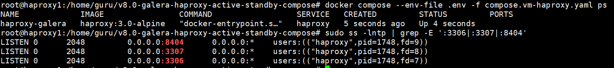
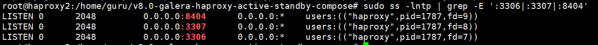
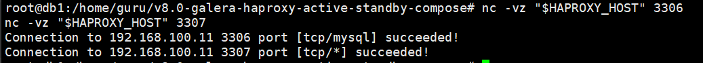

# 검증 초기화 가이드

`VALIDATION.md`를 처음부터 다시 진행하기 위해 현재 실습 상태를 초기 구성으로 되돌리는 절차다.

두 가지 방식이 있다.

- 데이터 보존 재시작: 컨테이너만 다시 올린다.
- 완전 초기화: 컨테이너와 DB 볼륨을 삭제하고 새 클러스터를 다시 만든다.

실습 검증을 깨끗하게 다시 시작하려면 **완전 초기화**를 사용한다.

## 0. 현재 구조

| VM | IP | 역할 |
|---|---:|---|
| haproxy1 | `192.168.100.11` | HAProxy 1 |
| haproxy2 | `192.168.100.12` | HAProxy 2 |
| db1 | `192.168.100.30` | Galera bootstrap 기준 노드 |
| db2 | `192.168.100.40` | Galera joiner |
| db3 | `192.168.100.50` | Galera joiner |

검증 명령 실행 VM은 보통 `db1`을 사용한다. 별도 클라이언트 VM이 없어도 된다.

## 1. 데이터 보존 재시작

데이터 볼륨을 지우지 않고, 장애 검증 중 중지한 컨테이너만 복구한다.

### 1.1 DB VM 복구

db1, db2, db3 각각에서 실행한다.

```bash
cd ~/v8.0-galera-haproxy-active-standby-compose
docker compose --env-file .env -f compose.vm-db.yaml up -d
docker compose --env-file .env -f compose.vm-db.yaml ps
```

각 DB VM에서 상태를 확인한다.

```bash
bash scripts/status-db.sh
```

정상 기준:

| VM | read_only | cluster_size | local_state |
|---|---:|---:|---|
| db1 | `0` | `3` | `Synced` |
| db2 | `0` | `3` | `Synced` |
| db3 | `0` | `3` | `Synced` |

### 1.2 HAProxy VM 복구

haproxy1에서 실행한다.

```bash
cd ~/v8.0-galera-haproxy-active-standby-compose
cp .env.vm-haproxy1.example .env
docker compose --env-file .env -f compose.vm-haproxy.yaml up -d
docker compose --env-file .env -f compose.vm-haproxy.yaml ps
```

haproxy2에서 실행한다.

```bash
cd ~/v8.0-galera-haproxy-active-standby-compose
cp .env.vm-haproxy2.example .env
docker compose --env-file .env -f compose.vm-haproxy.yaml up -d
docker compose --env-file .env -f compose.vm-haproxy.yaml ps
```

포트 확인:

```bash
sudo ss -lntp | grep -E ':3306|:3307|:8404'
```

### 1.3 VALIDATION 재시작 위치

데이터 보존 재시작이 성공했다면 [VALIDATION.md](VALIDATION.md)의 `0. 클라이언트 변수와 포트 사전 점검`부터 다시 진행한다.

## 2. 완전 초기화

이 절차는 **DB 데이터 볼륨을 삭제한다.** 운영 데이터가 있으면 실행하지 않는다.

### 2.1 HAProxy 중지

haproxy1에서 실행한다.

```bash
cd ~/v8.0-galera-haproxy-active-standby-compose
cp .env.vm-haproxy1.example .env
docker compose --env-file .env -f compose.vm-haproxy.yaml down
```

haproxy2에서 실행한다.

```bash
cd ~/v8.0-galera-haproxy-active-standby-compose
cp .env.vm-haproxy2.example .env
docker compose --env-file .env -f compose.vm-haproxy.yaml down
```

### 2.2 DB 컨테이너와 볼륨 삭제

db3에서 실행한다.

```bash
cd ~/v8.0-galera-haproxy-active-standby-compose
cp .env.vm-db3.example .env
docker compose --env-file .env -f compose.vm-db.yaml down
docker volume rm galera-as-db3-data 2>/dev/null || true
```

db2에서 실행한다.

```bash
cd ~/v8.0-galera-haproxy-active-standby-compose
cp .env.vm-db2.example .env
docker compose --env-file .env -f compose.vm-db.yaml down
docker volume rm galera-as-db2-data 2>/dev/null || true
```

db1에서 실행한다.

```bash
cd ~/v8.0-galera-haproxy-active-standby-compose
cp .env.vm-db1.example .env
docker compose --env-file .env -f compose.vm-db.yaml down
docker volume rm galera-as-db1-data 2>/dev/null || true
```

### 2.3 Secret 확인

완전 초기화는 DB 데이터만 지운다. secret은 기존 값을 그대로 재사용해도 된다.

db1에서 확인한다.

```bash
cd ~/v8.0-galera-haproxy-active-standby-compose
ls -l secrets/*.txt
sha256sum secrets/*.txt
```

db2, db3에서도 같은 checksum인지 확인한다.

```bash
cd ~/v8.0-galera-haproxy-active-standby-compose
sha256sum secrets/*.txt
```

secret을 새로 만들고 싶으면 db1에서 생성 후 db2, db3로 다시 복사한다.

```bash
cd ~/v8.0-galera-haproxy-active-standby-compose
openssl rand -hex 24 | tr -d '\n' > secrets/root_password.txt
openssl rand -hex 24 | tr -d '\n' > secrets/app_password.txt
openssl rand -hex 24 | tr -d '\n' > secrets/sst_password.txt
chmod 644 secrets/*.txt
sha256sum secrets/*.txt

scp secrets/*.txt guru@192.168.100.40:/home/guru/v8.0-galera-haproxy-active-standby-compose/secrets/
scp secrets/*.txt guru@192.168.100.50:/home/guru/v8.0-galera-haproxy-active-standby-compose/secrets/
```

### 2.4 이미지 빌드 확인

db1, db2, db3 각각에서 실행한다.

```bash
cd ~/v8.0-galera-haproxy-active-standby-compose
docker compose --env-file .env -f compose.vm-db.yaml config >/dev/null
docker compose --env-file .env -f compose.vm-db.yaml build
```

### 2.5 db1 bootstrap

db1에서 실행한다.

```bash
cd ~/v8.0-galera-haproxy-active-standby-compose
cp .env.vm-db1.example .env
sed -i 's/^GALERA_BOOTSTRAP=.*/GALERA_BOOTSTRAP=1/' .env
docker compose --env-file .env -f compose.vm-db.yaml up -d
docker compose --env-file .env -f compose.vm-db.yaml ps
```

db1이 healthy가 될 때까지 기다린다.

```bash
bash scripts/status-db.sh
```

정상 기준:

- `cluster_size = 1`
- `cluster_status = Primary`
- `ready = ON`
- `local_state = Synced`

### 2.6 db2 합류

db2에서 실행한다.

```bash
cd ~/v8.0-galera-haproxy-active-standby-compose
cp .env.vm-db2.example .env
docker compose --env-file .env -f compose.vm-db.yaml up -d
docker compose --env-file .env -f compose.vm-db.yaml ps
```

정상 확인:

```bash
bash scripts/status-db.sh
```

정상 기준은 `cluster_size = 2`, `local_state = Synced`다.

### 2.7 db3 합류

db3에서 실행한다.

```bash
cd ~/v8.0-galera-haproxy-active-standby-compose
cp .env.vm-db3.example .env
docker compose --env-file .env -f compose.vm-db.yaml up -d
docker compose --env-file .env -f compose.vm-db.yaml ps
```

정상 확인:

```bash
bash scripts/status-db.sh
```

정상 기준은 `cluster_size = 3`, `local_state = Synced`다.

### 2.8 db1 bootstrap 해제

db1에서 실행한다.

```bash
cd ~/v8.0-galera-haproxy-active-standby-compose
sed -i 's/^GALERA_BOOTSTRAP=.*/GALERA_BOOTSTRAP=0/' .env
docker compose --env-file .env -f compose.vm-db.yaml up -d --force-recreate
docker compose --env-file .env -f compose.vm-db.yaml ps
```

db1이 다시 healthy가 되면 세 DB VM 모두에서 확인한다.

```bash
bash scripts/status-db.sh
```

최종 정상 기준:

| VM | read_only | cluster_size | local_state |
|---|---:|---:|---|
| db1 | `0` | `3` | `Synced` |
| db2 | `0` | `3` | `Synced` |
| db3 | `0` | `3` | `Synced` |

### 2.9 HAProxy 재기동

haproxy1에서 실행한다.

```bash
cd ~/v8.0-galera-haproxy-active-standby-compose
cp .env.vm-haproxy1.example .env
docker compose --env-file .env -f compose.vm-haproxy.yaml up -d
docker compose --env-file .env -f compose.vm-haproxy.yaml ps
sudo ss -lntp | grep -E ':3306|:3307|:8404'
```


haproxy2에서 실행한다.

```bash
cd ~/v8.0-galera-haproxy-active-standby-compose
cp .env.vm-haproxy2.example .env
docker compose --env-file .env -f compose.vm-haproxy.yaml up -d
docker compose --env-file .env -f compose.vm-haproxy.yaml ps
sudo ss -lntp | grep -E ':3306|:3307|:8404'
```


### 2.10 VALIDATION 처음부터 진행

db1 VM에서 실행한다.

```bash
cd ~/v8.0-galera-haproxy-active-standby-compose
APP_PASSWORD="$(cat secrets/app_password.txt)"
APP_USER="$(grep '^MARIADB_USER=' .env | cut -d= -f2-)"
APP_DB="$(grep '^MARIADB_DATABASE=' .env | cut -d= -f2-)"
HAPROXY_HOST=192.168.100.11

printf 'APP_USER=%s APP_DB=%s HAPROXY_HOST=%s\n' "$APP_USER" "$APP_DB" "$HAPROXY_HOST"
```

HAProxy 접근 확인:

```bash
nc -vz "$HAPROXY_HOST" 3306
nc -vz "$HAPROXY_HOST" 3307
```


이제 [VALIDATION.md](VALIDATION.md)의 `1. 정상 상태`부터 다시 진행한다.

## 3. 자주 걸리는 상태

### 3.1 `Unknown server host '-P3307'`

`HAPROXY_HOST`가 비어 있는 상태다.

```bash
echo "HAPROXY_HOST=[$HAPROXY_HOST]"
HAPROXY_HOST=192.168.100.11
```

### 3.2 `Can't connect to server on '192.168.100.12'`

haproxy2가 내려가 있거나 포트가 막힌 상태다.

```bash
ping -c 3 192.168.100.12
nc -vz 192.168.100.12 3306
nc -vz 192.168.100.12 3307
```

haproxy2에서 확인:

```bash
cd ~/v8.0-galera-haproxy-active-standby-compose
cp .env.vm-haproxy2.example .env
docker compose --env-file .env -f compose.vm-haproxy.yaml up -d
docker logs --tail 100 haproxy-galera
sudo ss -lntp | grep -E ':3306|:3307|:8404'
```

### 3.3 cluster size가 3이 아님

각 DB VM에서 `.env`와 컨테이너 상태를 확인한다.

```bash
cat .env
docker compose --env-file .env -f compose.vm-db.yaml ps
docker logs --tail 120 galera-db
bash scripts/status-db.sh
```
