# 검증 절차

이 검증은 VIP 없이 `haproxy1` 또는 `haproxy2`에 직접 접속한다.

## 0. 클라이언트 변수와 포트 사전 점검

검증 명령을 실행하는 VM에서 먼저 접속 대상과 DB 계정 변수를 설정한다.

```bash
cd ~/v8.0-galera-haproxy-active-standby-compose

APP_PASSWORD="$(cat secrets/app_password.txt)"
APP_USER="$(grep '^MARIADB_USER=' .env | cut -d= -f2-)"
APP_DB="$(grep '^MARIADB_DATABASE=' .env | cut -d= -f2-)"
HAPROXY_HOST=192.168.100.11
MYSQL_CONNECT_TIMEOUT=5

printf 'APP_USER=%s APP_DB=%s HAPROXY_HOST=%s MYSQL_CONNECT_TIMEOUT=%s\n' \
  "$APP_USER" "$APP_DB" "$HAPROXY_HOST" "$MYSQL_CONNECT_TIMEOUT"
```

`HAPROXY_HOST`가 비어 있으면 `mariadb -h"$HAPROXY_HOST" -P3307 ...` 명령에서 `-P3307`이 host 값처럼 해석되어 다음 오류가 날 수 있다.

```text
ERROR 2005 (HY000): Unknown server host '-P3307'
```

HAProxy 포트가 열려 있는지도 확인한다.

```bash
ping -c 3 "$HAPROXY_HOST"
nc -vz -w 3 "$HAPROXY_HOST" 3306
nc -vz -w 3 "$HAPROXY_HOST" 3307
nc -vz -w 3 "$HAPROXY_HOST" 8404
```

`nc`가 없다면 설치한다.

```bash
sudo apt install -y netcat-openbsd
```

## 1. 정상 상태

db1, db2, db3에서 확인한다.

```bash
bash scripts/status-db.sh
```

정상 기준:

| VM | read_only | cluster_size | local_state |
|---|---:|---:|---|
| db1 | `0` | `3` | `Synced` |
| db2 | `0` | `3` | `Synced` |
| db3 | `0` | `3` | `Synced` |

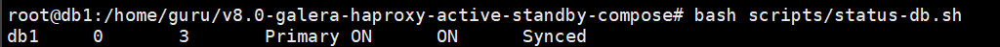
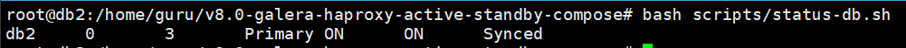
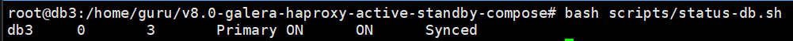

## 2. write endpoint 검증

db1 또는 클라이언트에서 실행한다.

```bash
for i in $(seq 1 5); do
  mariadb --connect-timeout="$MYSQL_CONNECT_TIMEOUT" -h"$HAPROXY_HOST" -P3306 -u"$APP_USER" -p"$APP_PASSWORD" "$APP_DB" \
    --batch --skip-column-names \
    -e "SELECT @@hostname, @@read_only;"
done
```

정상 기준은 모두 `db1 0`이다. round robin이 없어야 한다.

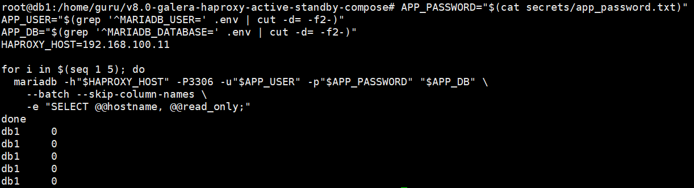

## 3. read endpoint 검증

```bash
for i in $(seq 1 5); do
  mariadb --connect-timeout="$MYSQL_CONNECT_TIMEOUT" -h"$HAPROXY_HOST" -P3307 -u"$APP_USER" -p"$APP_PASSWORD" "$APP_DB" \
    --batch --skip-column-names \
    -e "SELECT @@hostname, @@read_only;"
done
```

정상 기준은 모두 `db2 0`이다.

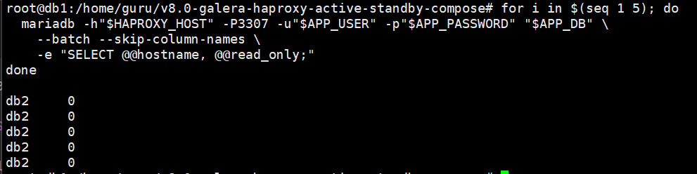

## 4. HAProxy 2대 직접 접속 검증

haproxy1, haproxy2가 같은 결과를 내야 한다.

```bash
for host in 192.168.100.11 192.168.100.12; do
  echo "=== $host write ==="
  mariadb --connect-timeout="$MYSQL_CONNECT_TIMEOUT" -h"$host" -P3306 -u"$APP_USER" -p"$APP_PASSWORD" "$APP_DB" \
    --batch --skip-column-names \
    -e "SELECT @@hostname, @@read_only;"

  echo "=== $host read ==="
  mariadb --connect-timeout="$MYSQL_CONNECT_TIMEOUT" -h"$host" -P3307 -u"$APP_USER" -p"$APP_PASSWORD" "$APP_DB" \
    --batch --skip-column-names \
    -e "SELECT @@hostname, @@read_only;"
done
```

정상 기준은 write가 `db1 0`, read가 `db2 0`이다.

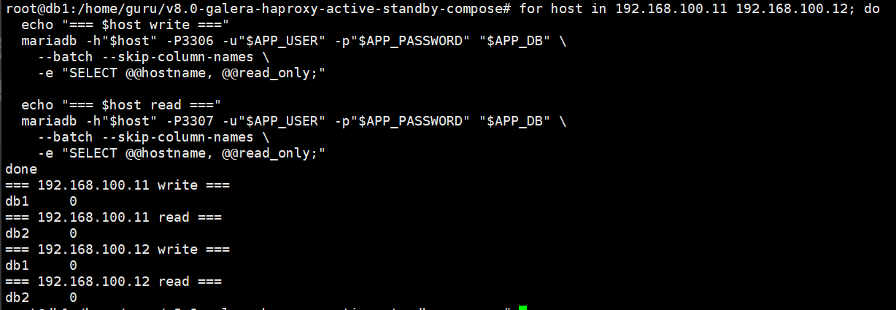

## 5. haproxy1 장애 검증

haproxy1에서 실행한다.

```bash
docker stop haproxy-galera
```
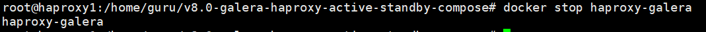

클라이언트는 haproxy2로 접속해야 한다.

```bash
HAPROXY_HOST=192.168.100.12
nc -vz -w 3 "$HAPROXY_HOST" 3306
nc -vz -w 3 "$HAPROXY_HOST" 3307

mariadb --connect-timeout="$MYSQL_CONNECT_TIMEOUT" -h"$HAPROXY_HOST" -P3306 -u"$APP_USER" -p"$APP_PASSWORD" "$APP_DB" \
  -e "SELECT @@hostname, @@read_only;"
```
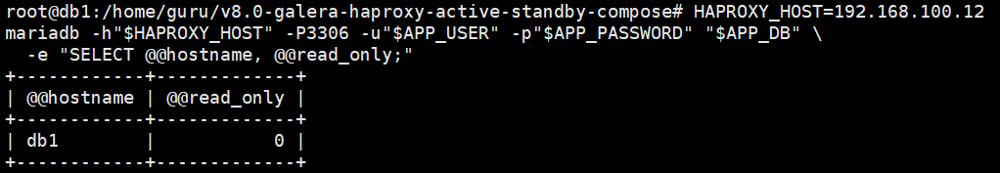

정상 기준은 `db1 0`이다.

## 6. db2 장애 시 db3 read 대체

db2에서 실행한다.

```bash
docker compose --env-file .env -f compose.vm-db.yaml stop
```

HAProxy가 db2를 DOWN으로 판정할 때까지 잠시 기다린다. HAProxy healthcheck는 보통 2-3초 안에 반영된다.

```bash
sleep 5
curl -s "http://${HAPROXY_HOST}:8404/;csv" | grep ',db2,'
curl -s "http://${HAPROXY_HOST}:8404/;csv" | grep ',db3,'
nc -vz -w 3 "$HAPROXY_HOST" 3307
```

클라이언트에서 read endpoint 확인:

```bash
for i in $(seq 1 5); do
  mariadb --connect-timeout="$MYSQL_CONNECT_TIMEOUT" -h"$HAPROXY_HOST" -P3307 -u"$APP_USER" -p"$APP_PASSWORD" "$APP_DB" \
    --batch --skip-column-names \
    -e "SELECT @@hostname, @@read_only;"
done
```

정상 기준은 `db3 0`이다.

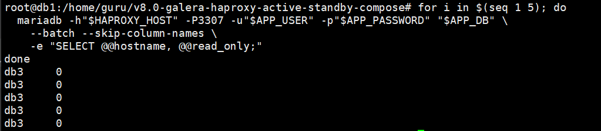

다음 단계인 db1 장애 검증은 db2가 살아 있어야 의미가 있다. db2를 다시 올리고 `Synced` 상태를 확인한다.

```bash
# db2에서 실행
docker compose --env-file .env -f compose.vm-db.yaml up -d
docker compose --env-file .env -f compose.vm-db.yaml ps
bash scripts/status-db.sh
```

HAProxy가 db2를 다시 UP으로 인식할 때까지 잠시 기다린다.

```bash
sleep 5
curl -s "http://${HAPROXY_HOST}:8404/;csv" | grep ',db2,'
```

정상 기준은 db2가 `UP`이고 read endpoint가 다시 `db2 0`을 반환하는 것이다.

```bash
mariadb --connect-timeout="$MYSQL_CONNECT_TIMEOUT" -h"$HAPROXY_HOST" -P3307 -u"$APP_USER" -p"$APP_PASSWORD" "$APP_DB" \
  -e "SELECT @@hostname, @@read_only;"
```
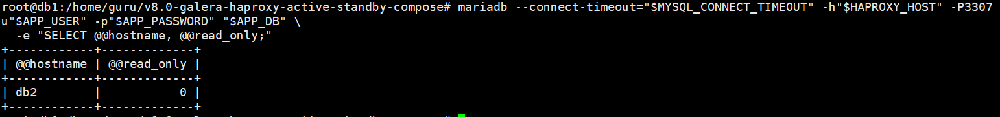

## 7. db1 장애 시 db2 write 대체

db1에서 실행한다.

```bash
docker compose --env-file .env -f compose.vm-db.yaml stop
```

HAProxy가 db1를 DOWN으로 판정할 때까지 잠시 기다린다.

```bash
sleep 5
curl -s "http://${HAPROXY_HOST}:8404/;csv" | grep ',db1,'
curl -s "http://${HAPROXY_HOST}:8404/;csv" | grep ',db2,'
nc -vz -w 3 "$HAPROXY_HOST" 3306
```
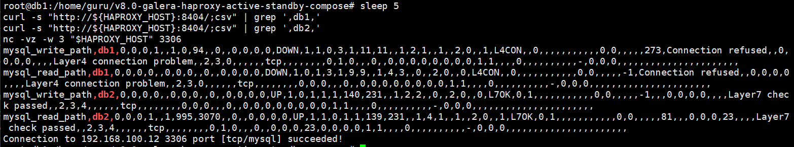

클라이언트에서 write endpoint 확인:

```bash
for i in $(seq 1 5); do
  mariadb --connect-timeout="$MYSQL_CONNECT_TIMEOUT" -h"$HAPROXY_HOST" -P3306 -u"$APP_USER" -p"$APP_PASSWORD" "$APP_DB" \
    --batch --skip-column-names \
    -e "SELECT @@hostname, @@read_only;"
done
```

정상 기준은 `db2 0`이다. db2도 장애이면 다음 backup인 db3가 write endpoint를 받는다.

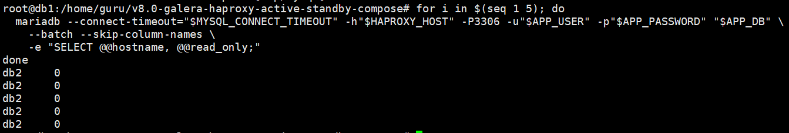

## 8. db1과 db2 동시 장애 시 db3 write/read 대체

7번 단계에서 db1을 중지한 상태에서 db2도 중지한다.

```bash
# db2에서 실행
docker compose --env-file .env -f compose.vm-db.yaml stop
```

write endpoint와 read endpoint가 모두 db3로 가는지 확인한다.

```bash
mariadb --connect-timeout="$MYSQL_CONNECT_TIMEOUT" -h"$HAPROXY_HOST" -P3306 -u"$APP_USER" -p"$APP_PASSWORD" "$APP_DB" \
  -e "SELECT @@hostname, @@read_only;"

mariadb --connect-timeout="$MYSQL_CONNECT_TIMEOUT" -h"$HAPROXY_HOST" -P3307 -u"$APP_USER" -p"$APP_PASSWORD" "$APP_DB" \
  -e "SELECT @@hostname, @@read_only;"
```

정상 기준은 둘 다 `db3 0`이다.

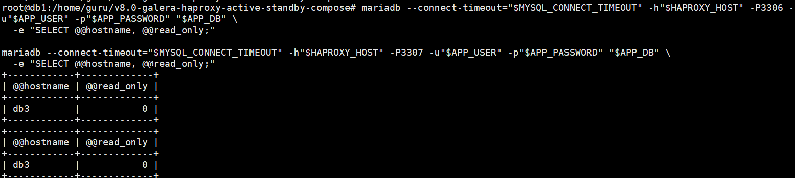

## 9. failback

db1과 db2를 복구한다.

```bash
docker compose --env-file .env -f compose.vm-db.yaml up -d
```

각 노드가 `Synced`가 된 뒤 write endpoint가 다시 db1로 가는지 확인한다.

```bash
mariadb --connect-timeout="$MYSQL_CONNECT_TIMEOUT" -h"$HAPROXY_HOST" -P3306 -u"$APP_USER" -p"$APP_PASSWORD" "$APP_DB" \
  -e "SELECT @@hostname, @@read_only;"
```

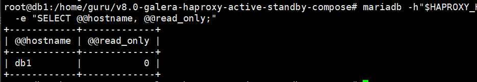

## 10. 오류별 확인 포인트

`Unknown server host '-P3307'`:

```bash
echo "HAPROXY_HOST=[$HAPROXY_HOST]"
HAPROXY_HOST=192.168.100.11
```

`Can't connect to server on '192.168.100.12' (115)`:

```bash
ping -c 3 192.168.100.12
nc -vz 192.168.100.12 3306
nc -vz 192.168.100.12 3307
```

`3306`은 되는데 `3307`만 멈추거나 timeout이면 haproxy2 VM에서 방화벽과 리슨 상태를 먼저 확인한다.

haproxy2 VM에서 컨테이너와 리슨 포트를 확인한다.

```bash
cd ~/v8.0-galera-haproxy-active-standby-compose
docker compose --env-file .env -f compose.vm-haproxy.yaml ps
docker logs --tail 100 haproxy-galera
sudo ss -lntp | grep -E ':3306|:3307|:8404'
sudo ufw status numbered
```

haproxy2가 내려가 있으면 다시 올린다.

```bash
cp .env.vm-haproxy2.example .env
docker compose --env-file .env -f compose.vm-haproxy.yaml up -d --force-recreate
```

haproxy2의 UFW가 3307을 막고 있으면 실습 대역을 허용한다.

```bash
sudo ufw allow from 192.168.100.0/24 to any port 3307 proto tcp
```
