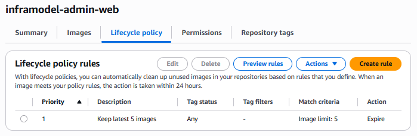
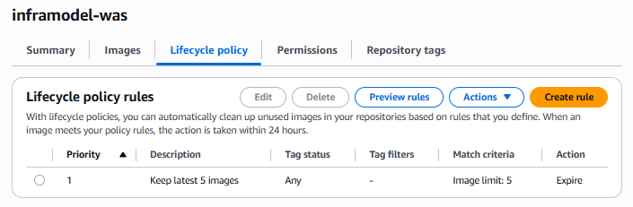
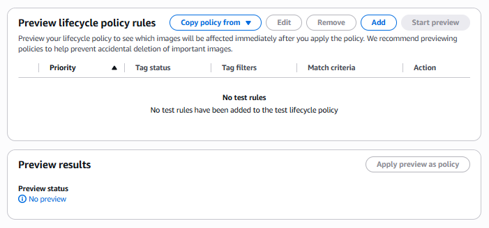

# AWS ECR 이미지 배포 가이드

이 문서는 VMware에서 검증한 `v8.0-haproxy-galera-compose` 구성을 AWS ECR 이미지 기반으로 배포하는 절차다. DB VM은 로컬에서 이미지를 빌드하지 않고 ECR에서 pull한다.

## 1. 배포 대상

| 대상      | 이미지                   | ECR 필요 여부 | 비고                                                        |
| --------- | ------------------------ | ------------- | ----------------------------------------------------------- |
| Galera DB | `haproxy-galera-mariadb` | 필수          | 이 프로젝트의 `Dockerfile`로 빌드하는 커스텀 MariaDB 이미지 |
| HAProxy   | `haproxy:3.0-alpine`     | 선택          | 기본은 Docker Hub 공식 이미지 사용, 필요 시 ECR로 미러링    |

Secret 파일과 `.env`는 이미지에 포함하지 않는다. `secrets/*.txt`, `.env`, `haproxy/haproxy.vm.cfg`, `config/vm/60-galera-common.cnf`는 각 VM의 파일시스템에 배치한다.

## 2. 사전 준비

빌드/푸시 작업을 수행할 PC 또는 VM에 아래 도구가 필요하다.

```bash
aws --version
docker --version
docker compose version
```

AWS CLI 인증이 되어 있어야 한다.

```bash
aws sts get-caller-identity
```

이 문서의 예시는 서울 리전 기준이다.

```bash
export AWS_REGION=ap-northeast-2
export AWS_ACCOUNT_ID="$(aws sts get-caller-identity --query Account --output text)"
export ECR_REGISTRY="${AWS_ACCOUNT_ID}.dkr.ecr.${AWS_REGION}.amazonaws.com"
export DB_REPOSITORY=haproxy-galera-mariadb
export DB_IMAGE_TAG=11.8.8-v1
export DB_IMAGE_URI="${ECR_REGISTRY}/${DB_REPOSITORY}:${DB_IMAGE_TAG}"
```

## 3. ECR repository 생성

이미 repository가 있으면 `RepositoryAlreadyExistsException`이 날 수 있다. 그 경우 다음 단계로 진행한다.

```bash
aws ecr create-repository \
  --region "$AWS_REGION" \
  --repository-name "$DB_REPOSITORY" \
  --image-scanning-configuration scanOnPush=true \
  --encryption-configuration encryptionType=AES256
```

선택 사항으로 태그 변경을 막고 싶다면 immutable을 켠다.

```bash
aws ecr put-image-tag-mutability \
  --region "$AWS_REGION" \
  --repository-name "$DB_REPOSITORY" \
  --image-tag-mutability IMMUTABLE
```

## 4. ECR 로그인

빌드/푸시 작업 호스트에서 실행한다.

```bash
aws ecr get-login-password --region "$AWS_REGION" \
  | docker login --username AWS --password-stdin "$ECR_REGISTRY"
```

DB VM과 HAProxy VM에서도 ECR 이미지를 pull해야 한다면 같은 로그인을 수행한다. EC2에서 실행할 때는 instance profile에 ECR pull 권한을 부여하는 방식이 더 운영 친화적이다.

## 5. DB 이미지 빌드

프로젝트 폴더에서 실행한다.

```bash
cd ~/v8.0-haproxy-galera-compose
docker build -t "${DB_REPOSITORY}:${DB_IMAGE_TAG}" .
docker tag "${DB_REPOSITORY}:${DB_IMAGE_TAG}" "${DB_IMAGE_URI}"
```

이미지에 포함되는 파일:

- `Dockerfile`
- `docker-entrypoint-galera.sh`
- `initdb-create-users.sh`
- MariaDB base image와 `socat`, `rsync`, `mariadb-backup`

이미지에 포함되지 않는 파일:

- `.env`
- `secrets/*.txt`
- DB 데이터 볼륨
- HAProxy 설정 파일

## 6. DB 이미지 푸시

```bash
docker push "${DB_IMAGE_URI}"
```

푸시 확인:

```bash
aws ecr describe-images \
  --region "$AWS_REGION" \
  --repository-name "$DB_REPOSITORY" \
  --image-ids imageTag="$DB_IMAGE_TAG"
```

## 7. HAProxy 이미지 처리

기본 구성은 HAProxy VM이 Docker Hub에서 `haproxy:3.0-alpine`을 pull한다. Docker Hub 접근을 막거나 모든 이미지를 ECR에서만 받도록 운영하려면 HAProxy 공식 이미지를 ECR로 미러링한다.

```bash
export HAPROXY_REPOSITORY=haproxy
export HAPROXY_IMAGE_TAG=3.0-alpine
export HAPROXY_IMAGE_URI="${ECR_REGISTRY}/${HAPROXY_REPOSITORY}:${HAPROXY_IMAGE_TAG}"

aws ecr create-repository \
  --region "$AWS_REGION" \
  --repository-name "$HAPROXY_REPOSITORY" \
  --image-scanning-configuration scanOnPush=true \
  --encryption-configuration encryptionType=AES256

docker pull "haproxy:${HAPROXY_IMAGE_TAG}"
docker tag "haproxy:${HAPROXY_IMAGE_TAG}" "${HAPROXY_IMAGE_URI}"
docker push "${HAPROXY_IMAGE_URI}"
```

미러링하지 않는다면 `HAPROXY_IMAGE_URI`를 설정하지 않아도 된다.

## 8. DB VM 배포 파일 준비

db1, db2, db3 VM 각각에 프로젝트 파일을 배치한다.

```bash
cd ~/v8.0-haproxy-galera-compose
cp .env.vm-db1.example .env   # db1에서만
cp .env.vm-db2.example .env   # db2에서만
cp .env.vm-db3.example .env   # db3에서만
```

각 DB VM의 `.env` 맨 아래에 ECR 이미지 URI를 추가한다.

```bash
cat >> .env <<EOF
MARIADB_IMAGE_URI=${DB_IMAGE_URI}
EOF
```

`DB_IMAGE_URI` 환경 변수가 없는 터미널이라면 실제 값을 직접 넣는다.

```dotenv
MARIADB_IMAGE_URI=123456789012.dkr.ecr.ap-northeast-2.amazonaws.com/haproxy-galera-mariadb:11.8.8-v1
```

secret 파일은 기존 VMware 검증과 동일하게 db1에서 생성하고 db2, db3로 복사한다.

```bash
mkdir -p secrets
openssl rand -hex 24 | tr -d '\n' > secrets/root_password.txt
openssl rand -hex 24 | tr -d '\n' > secrets/app_password.txt
openssl rand -hex 24 | tr -d '\n' > secrets/sst_password.txt
chmod 644 secrets/*.txt
sha256sum secrets/*.txt
```

```bash
scp secrets/*.txt guru@192.168.100.40:/home/guru/v8.0-haproxy-galera-compose/secrets/
scp secrets/*.txt guru@192.168.100.50:/home/guru/v8.0-haproxy-galera-compose/secrets/
```

## 9. DB VM에서 ECR 이미지 pull

db1, db2, db3에서 실행한다.

```bash
aws ecr get-login-password --region ap-northeast-2 \
  | docker login --username AWS --password-stdin 123456789012.dkr.ecr.ap-northeast-2.amazonaws.com

docker compose --env-file .env -f compose.vm-db.ecr.yaml pull
docker compose --env-file .env -f compose.vm-db.ecr.yaml config >/dev/null
```

`123456789012`와 region은 실제 계정과 리전에 맞춘다.

## 10. ECR 이미지로 Galera 기동

기동 순서는 VMware 검증과 동일하다. 차이는 `compose.vm-db.yaml` 대신 `compose.vm-db.ecr.yaml`을 사용하는 것이다.

db1 bootstrap:

```bash
cd ~/v8.0-haproxy-galera-compose
sed -i 's/^GALERA_BOOTSTRAP=.*/GALERA_BOOTSTRAP=1/' .env
docker compose --env-file .env -f compose.vm-db.ecr.yaml up -d
docker compose --env-file .env -f compose.vm-db.ecr.yaml ps
```

db2, db3 합류:

```bash
cd ~/v8.0-haproxy-galera-compose
docker compose --env-file .env -f compose.vm-db.ecr.yaml up -d
docker compose --env-file .env -f compose.vm-db.ecr.yaml ps
```

db1 bootstrap 해제:

```bash
sed -i 's/^GALERA_BOOTSTRAP=.*/GALERA_BOOTSTRAP=0/' .env
docker compose --env-file .env -f compose.vm-db.ecr.yaml up -d --force-recreate
```

상태 확인:

```bash
ROOT_PASSWORD="$(cat secrets/root_password.txt)"
docker exec galera-db mariadb --protocol=socket -uroot -p"$ROOT_PASSWORD" -e "
SELECT @@hostname, @@read_only;
SHOW STATUS LIKE 'wsrep_cluster_size';
SHOW STATUS LIKE 'wsrep_cluster_status';
SHOW STATUS LIKE 'wsrep_ready';
SHOW STATUS LIKE 'wsrep_local_state_comment';"
```

정상 기준은 세 DB VM 모두 `wsrep_cluster_size=3`, `wsrep_cluster_status=Primary`, `wsrep_ready=ON`, `Synced`다.

## 11. HAProxy VM 배포

HAProxy를 Docker Hub 공식 이미지로 사용할 경우:

```bash
cd ~/v8.0-haproxy-galera-compose
cp .env.vm-haproxy.example .env
docker compose --env-file .env -f compose.vm-haproxy.ecr.yaml up -d
docker compose --env-file .env -f compose.vm-haproxy.ecr.yaml ps
```

HAProxy 이미지를 ECR로 미러링했다면 `.env`에 `HAPROXY_IMAGE_URI`를 추가한다.

```bash
cat >> .env <<EOF
HAPROXY_IMAGE_URI=${HAPROXY_IMAGE_URI}
EOF

docker compose --env-file .env -f compose.vm-haproxy.ecr.yaml pull
docker compose --env-file .env -f compose.vm-haproxy.ecr.yaml up -d
```

HAProxy 설정 파일은 이미지가 아니라 VM의 `haproxy/haproxy.vm.cfg`를 bind mount한다. 설정을 바꾸면 이미지를 다시 빌드하지 않고 컨테이너만 재생성한다.

```bash
docker compose --env-file .env -f compose.vm-haproxy.ecr.yaml up -d --force-recreate
```

## 12. 검증

평상시 라운드로빈:

```bash
APP_PASSWORD="$(cat secrets/app_password.txt)"
APP_USER="$(grep '^MARIADB_USER=' .env | cut -d= -f2-)"
APP_DB="$(grep '^MARIADB_DATABASE=' .env | cut -d= -f2-)"

for i in $(seq 1 10); do
  docker exec galera-db mariadb \
    -h192.168.100.5 -P3306 \
    -u"$APP_USER" -p"$APP_PASSWORD" "$APP_DB" \
    --batch --skip-column-names \
    -e "SELECT @@hostname;"
done
```

정상 기준은 `db1`, `db2`만 보이는 것이다.

장애 대체:

```bash
# db1에서 실행
docker compose --env-file .env -f compose.vm-db.ecr.yaml stop
```

다시 HAProxy로 접속하면 `db2`, `db3`가 보여야 한다. db1 복구:

```bash
docker compose --env-file .env -f compose.vm-db.ecr.yaml up -d
```

## 13. 새 버전 배포

새 Dockerfile 또는 entrypoint 변경 후 새 태그를 사용한다.

```bash
export DB_IMAGE_TAG=11.8.8-v2
export DB_IMAGE_URI="${ECR_REGISTRY}/${DB_REPOSITORY}:${DB_IMAGE_TAG}"

docker build -t "${DB_REPOSITORY}:${DB_IMAGE_TAG}" .
docker tag "${DB_REPOSITORY}:${DB_IMAGE_TAG}" "${DB_IMAGE_URI}"
docker push "${DB_IMAGE_URI}"
```

각 DB VM의 `.env`에서 `MARIADB_IMAGE_URI`만 새 태그로 변경한다.

```bash
sed -i 's#^MARIADB_IMAGE_URI=.*#MARIADB_IMAGE_URI=123456789012.dkr.ecr.ap-northeast-2.amazonaws.com/haproxy-galera-mariadb:11.8.8-v2#' .env
docker compose --env-file .env -f compose.vm-db.ecr.yaml pull
docker compose --env-file .env -f compose.vm-db.ecr.yaml up -d --force-recreate
```

롤링 순서는 db3, db2, db1을 권장한다. 한 번에 세 DB를 모두 재생성하지 않는다.

## 14. 권한 최소 기준

빌드/푸시 주체에는 최소한 다음 ECR 권한이 필요하다.

```text
ecr:GetAuthorizationToken
ecr:CreateRepository
ecr:DescribeRepositories
ecr:DescribeImages
ecr:BatchCheckLayerAvailability
ecr:InitiateLayerUpload
ecr:UploadLayerPart
ecr:CompleteLayerUpload
ecr:PutImage
ecr:PutImageTagMutability
```

pull만 하는 VM에는 다음 권한이면 충분하다.

```text
ecr:GetAuthorizationToken
ecr:BatchGetImage
ecr:BatchCheckLayerAvailability
ecr:GetDownloadUrlForLayer
```

## 15. ECR Lifecycle Policy 적용 및 검증

### 목적

Amazon ECR 저장소에 저장되는 컨테이너 이미지의 무분별한 증가를 방지하고 저장소 용량을 효율적으로 관리하기 위해 Lifecycle Policy를 적용한다.

---

### 적용 대상

- inframodel-admin-web
- inframodel-service-web
- inframodel-was

---

### 정책 설정

| 항목          | 값                    |
| ------------- | --------------------- |
| Rule Priority | 1                     |
| Tag Status    | Any                   |
| Count Type    | Image Count More Than |
| Image Count   | 5                     |
| Action        | Expire                |

---

### 정책 내용

각 ECR 저장소에 대해 최신 5개의 이미지만 유지하고, 이를 초과하는 이미지는 자동 삭제 대상으로 관리하도록 Lifecycle Policy를 구성하였다.

이를 통해 불필요한 이미지 누적을 방지하고 저장소 운영 및 관리 효율성을 향상시킬 수 있다.

---

### 검증 방법

1. AWS ECR 콘솔에서 각 저장소의 Lifecycle Policy 적용 여부를 확인한다.
2. Lifecycle Policy Preview를 실행한다.
3. 정책 설정이 정상 반영되었는지 확인한다.

---

### 검증 결과

- inframodel-admin-web 저장소에 Lifecycle Policy 적용 확인
- inframodel-service-web 저장소에 Lifecycle Policy 적용 확인
- inframodel-was 저장소에 Lifecycle Policy 적용 확인
- Lifecycle Policy Preview 실행 확인
- 현재 저장소 내 이미지 수가 정책 기준(5개)을 초과하지 않아 삭제 대상(Expire)은 표시되지 않음

---

### 증적

#### Admin Web Lifecycle Policy 설정



#### Service Web Lifecycle Policy 설정


#### WAS Lifecycle Policy 설정



#### Lifecycle Policy Preview 결과



## 16. 정리

로컬 이미지 정리:

```bash
docker image ls | grep haproxy-galera-mariadb
docker image rm "${DB_IMAGE_URI}" || true
```

ECR repository 삭제는 이미지가 모두 사라지므로 실습 종료 시에만 실행한다.

```bash
aws ecr delete-repository \
  --region "$AWS_REGION" \
  --repository-name "$DB_REPOSITORY" \
  --force
```

## 최종 체크리스트

- [ ] ECR repository `haproxy-galera-mariadb` 생성
- [ ] DB 이미지 build/tag/push 완료
- [ ] db1, db2, db3 `.env`에 같은 `MARIADB_IMAGE_URI` 설정
- [ ] db1, db2, db3에서 `compose.vm-db.ecr.yaml pull` 성공
- [ ] Galera cluster size `3`
- [ ] HAProxy VM 기동
- [ ] 정상 시 HAProxy 응답이 db1/db2로 분산
- [ ] db1 또는 db2 장애 시 db3가 응답에 포함
