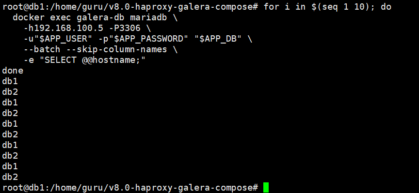
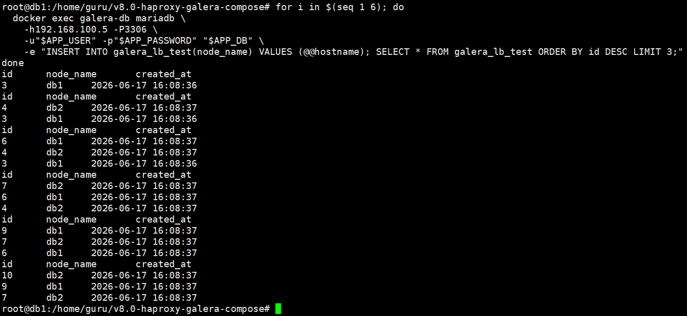
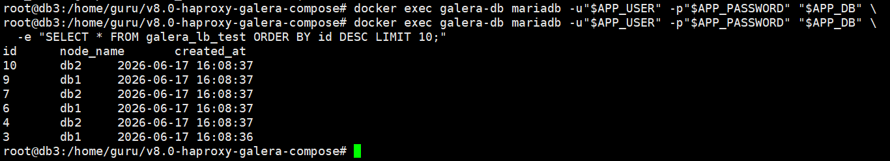
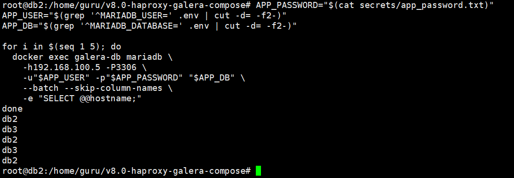
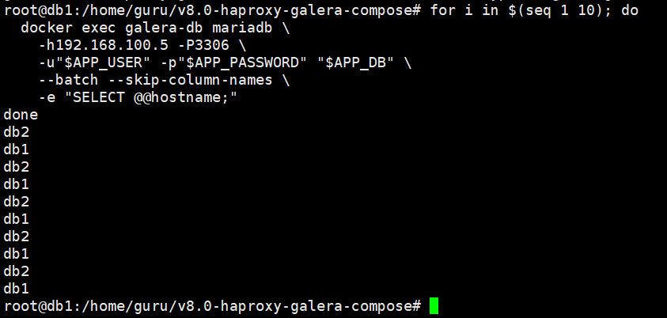
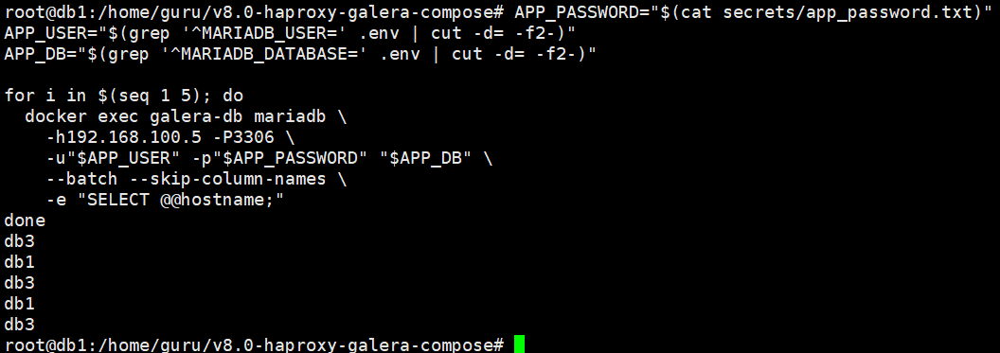
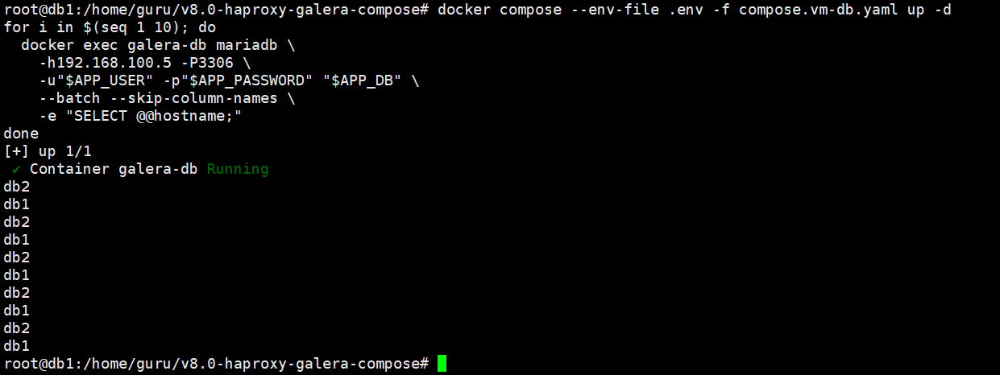
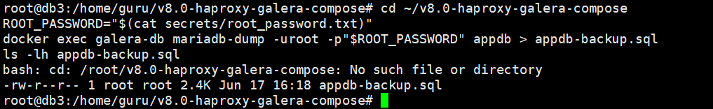

# VMware HAProxy + Galera 검증 가이드

이 가이드는 로컬 PC의 VMware에서 VM 여러 대를 만들고, 각 VM에 역할을 나누어 아래 구조를 검증하는 절차다.

```text
WAS 또는 테스트 클라이언트
        |
        v
HAProxy 192.168.100.5:3306
        |
        +-- normal roundrobin --> db1 192.168.100.30:3306
        +-- normal roundrobin --> db2 192.168.100.40:3306
        |
        +-- failover only -----> db3 192.168.100.50:3306

db3는 Galera 동기 복제에 참여하고, 평상시에는 트래픽을 받지 않다가 db1 또는 db2 장애 시 HAProxy failover backend에 포함된다.
```

## 1. VM 구성

Ubuntu 24.04 LTS VM 4대를 준비한다.

| VM | IP | 역할 | Compose 파일 |
|---|---:|---|---|
| `haproxy` | `192.168.100.5` | WAS 접속점, db1/db2 라운드로빈 | `compose.vm-haproxy.yaml` |
| `db1` | `192.168.100.30` | Galera active DB | `compose.vm-db.yaml` |
| `db2` | `192.168.100.40` | Galera active DB | `compose.vm-db.yaml` |
| `db3` | `192.168.100.50` | Galera 복제 및 장애 대체용 standby DB | `compose.vm-db.yaml` |

VMware 네트워크는 `192.168.100.0/24` 대역으로 서로 통신 가능해야 한다. Bridged 또는 Custom VMnet을 사용할 수 있다. 이미 로컬 LAN에서 이 대역을 사용 중이면 IP 충돌이 없는지 먼저 확인한다.

Ubuntu에서 정적 IP를 설정해야 한다면 각 VM에서 인터페이스 이름을 확인한다.

```bash
ip -br addr
```

Netplan 파일 예시는 아래와 같다. `ens33`은 실제 인터페이스 이름으로 바꾼다. IP 주소도 VM 역할에 맞게 `.5`, `.30`, `.40`, `.50` 중 하나를 넣는다.

```bash
sudo cp /etc/netplan/*.yaml /tmp/netplan.backup.yaml
sudo tee /etc/netplan/01-vmware-static.yaml >/dev/null <<EOF
network:
  version: 2
  ethernets:
    ens33:
      dhcp4: no
      addresses:
        - 192.168.100.30/24
      routes:
        - to: default
          via: 192.168.100.1
      nameservers:
        addresses:
          - 8.8.8.8
          - 1.1.1.1
EOF
sudo netplan apply
```

각 VM에서 IP를 확인한다.

```bash
hostname -I
ping -c 3 192.168.100.5
ping -c 3 192.168.100.30
ping -c 3 192.168.100.40
ping -c 3 192.168.100.50
```

## 2. Docker 설치

네 VM 모두에서 실행한다.

```bash
sudo apt update
sudo apt install -y ca-certificates curl
sudo install -m 0755 -d /etc/apt/keyrings
sudo curl -fsSL https://download.docker.com/linux/ubuntu/gpg -o /etc/apt/keyrings/docker.asc
sudo chmod a+r /etc/apt/keyrings/docker.asc

sudo tee /etc/apt/sources.list.d/docker.sources >/dev/null <<EOF
Types: deb
URIs: https://download.docker.com/linux/ubuntu
Suites: $(. /etc/os-release && echo "${UBUNTU_CODENAME:-$VERSION_CODENAME}")
Components: stable
Architectures: $(dpkg --print-architecture)
Signed-By: /etc/apt/keyrings/docker.asc
EOF

sudo apt update
sudo apt install -y docker-ce docker-ce-cli containerd.io docker-buildx-plugin docker-compose-plugin mariadb-client
sudo systemctl enable --now docker
sudo usermod -aG docker "$USER"
newgrp docker
```

호스트 MariaDB 서버가 켜져 있으면 3306 포트가 충돌하므로 DB VM에서 중지한다.

```bash
systemctl status mariadb --no-pager || true
sudo systemctl disable --now mariadb || true
sudo ss -lntup | grep ':3306' || true
```

## 3. 프로젝트 배치

네 VM 모두 같은 경로에 이 폴더를 배치한다.

```bash
cd ~
# 예: git clone 또는 XFTP/SCP로 v8.0-haproxy-galera-compose 폴더 복사
cd ~/v8.0-haproxy-galera-compose
```

DB VM에는 `Dockerfile`, `compose.vm-db.yaml`, `config/vm/60-galera-common.cnf`, `docker-entrypoint-galera.sh`, `initdb-create-users.sh`, `secrets/`가 필요하다.

HAProxy VM에는 `compose.vm-haproxy.yaml`, `haproxy/haproxy.vm.cfg`가 필요하다.

## 4. Secret 생성 및 복사

db1에서만 secret을 만든다.

```bash
cd ~/v8.0-haproxy-galera-compose
mkdir -p secrets
openssl rand -hex 24 | tr -d '\n' > secrets/root_password.txt
openssl rand -hex 24 | tr -d '\n' > secrets/app_password.txt
openssl rand -hex 24 | tr -d '\n' > secrets/sst_password.txt
chmod 644 secrets/*.txt
sha256sum secrets/*.txt
```

db1에서 만든 `secrets/*.txt` 3개를 db2와 db3의 같은 경로로 복사한다.

```bash
scp secrets/*.txt guru@192.168.100.40:/home/guru/v8.0-haproxy-galera-compose/secrets/
scp secrets/*.txt guru@192.168.100.50:/home/guru/v8.0-haproxy-galera-compose/secrets/
```

db2, db3에서 체크섬이 db1과 같은지 확인한다.

```bash
cd ~/v8.0-haproxy-galera-compose
chmod 644 secrets/*.txt
sha256sum secrets/*.txt
```

## 5. `.env` 생성

각 DB VM에서 자기 역할에 맞는 `.env`를 만든다.

```bash
# db1
cp .env.vm-db1.example .env

# db2
cp .env.vm-db2.example .env

# db3
cp .env.vm-db3.example .env
```

각 VM에서 `.env`를 확인한다.

```bash
cat .env
hostname -I
```

정상 기준:

| VM | `GALERA_NODE_ADDRESS` | `GALERA_READ_ONLY` |
|---|---:|---|
| db1 | `192.168.100.30` | `OFF` |
| db2 | `192.168.100.40` | `OFF` |
| db3 | `192.168.100.50` | `OFF` |

HAProxy VM에서는 아래처럼 만든다.

```bash
cp .env.vm-haproxy.example .env
```

## 6. 방화벽 허용

DB VM 3대에서 실행한다.

```bash
sudo ufw allow from 192.168.100.0/24 to any port 3306 proto tcp
sudo ufw allow from 192.168.100.0/24 to any port 4444 proto tcp
sudo ufw allow from 192.168.100.0/24 to any port 4567 proto tcp
sudo ufw allow from 192.168.100.0/24 to any port 4567 proto udp
sudo ufw allow from 192.168.100.0/24 to any port 4568 proto tcp
```

HAProxy VM에서 실행한다. WAS가 별도 VM이면 `<WAS_IP>`만 허용해도 된다.

```bash
sudo ufw allow from 192.168.100.0/24 to any port 3306 proto tcp
sudo ufw allow from 192.168.100.0/24 to any port 8404 proto tcp
```

## 7. Compose 설정 검증

DB VM 3대에서 실행한다.

```bash
cd ~/v8.0-haproxy-galera-compose
docker compose --env-file .env -f compose.vm-db.yaml config >/dev/null
docker compose --env-file .env -f compose.vm-db.yaml build --no-cache
```

HAProxy VM에서 실행한다.

```bash
cd ~/v8.0-haproxy-galera-compose
docker compose --env-file .env -f compose.vm-haproxy.yaml config >/dev/null
```

## 8. db1 부트스트랩

db1에서만 실행한다. 새 검증을 시작할 때만 기존 컨테이너와 실습 볼륨을 제거한다.

```bash
cd ~/v8.0-haproxy-galera-compose
docker compose --env-file .env -f compose.vm-db.yaml down
docker volume rm haproxy-galera-db1-data 2>/dev/null || true

sed -i 's/^GALERA_BOOTSTRAP=.*/GALERA_BOOTSTRAP=1/' .env
docker compose --env-file .env -f compose.vm-db.yaml up -d
docker compose --env-file .env -f compose.vm-db.yaml ps
```

db1 상태를 확인한다.

```bash
ROOT_PASSWORD="$(cat secrets/root_password.txt)"
docker exec galera-db mariadb --protocol=socket -uroot -p"$ROOT_PASSWORD" -e "
SELECT @@hostname, @@read_only;
SHOW STATUS LIKE 'wsrep_cluster_size';
SHOW STATUS LIKE 'wsrep_cluster_status';
SHOW STATUS LIKE 'wsrep_ready';
SHOW STATUS LIKE 'wsrep_local_state_comment';"
```

정상 기준은 `wsrep_cluster_size=1`, `wsrep_cluster_status=Primary`, `wsrep_ready=ON`, `wsrep_local_state_comment=Synced`다.

## 9. db2 합류

db2에서 실행한다.

```bash
cd ~/v8.0-haproxy-galera-compose
docker compose --env-file .env -f compose.vm-db.yaml down
docker volume rm haproxy-galera-db2-data 2>/dev/null || true
docker compose --env-file .env -f compose.vm-db.yaml up -d
docker compose --env-file .env -f compose.vm-db.yaml ps
```

상태 확인:

```bash
ROOT_PASSWORD="$(cat secrets/root_password.txt)"
docker exec galera-db mariadb --protocol=socket -uroot -p"$ROOT_PASSWORD" -e "
SELECT @@hostname, @@read_only;
SHOW STATUS LIKE 'wsrep_cluster_size';
SHOW STATUS LIKE 'wsrep_ready';
SHOW STATUS LIKE 'wsrep_local_state_comment';"
```

정상 기준은 `@@read_only=0`, `wsrep_cluster_size=2`, `wsrep_ready=ON`, `Synced`다.

## 10. db3 합류

db3에서 실행한다.

```bash
cd ~/v8.0-haproxy-galera-compose
docker compose --env-file .env -f compose.vm-db.yaml down
docker volume rm haproxy-galera-db3-data 2>/dev/null || true
docker compose --env-file .env -f compose.vm-db.yaml up -d
docker compose --env-file .env -f compose.vm-db.yaml ps
```

정상 기준은 `@@read_only=0`, `wsrep_cluster_size=3`, `wsrep_ready=ON`, `Synced`다. db3는 평상시에 HAProxy 트래픽을 받지 않지만, 장애 대체 시 쓰기 요청을 처리해야 하므로 `read_only=OFF`로 둔다.

## 11. db1 bootstrap 해제

db2와 db3가 모두 `Synced`가 된 뒤 db1에서 실행한다.

```bash
cd ~/v8.0-haproxy-galera-compose
sed -i 's/^GALERA_BOOTSTRAP=.*/GALERA_BOOTSTRAP=0/' .env
docker compose --env-file .env -f compose.vm-db.yaml up -d --force-recreate
docker compose --env-file .env -f compose.vm-db.yaml ps
```

최종 정상 기준:

| VM | read_only | cluster_size | 상태 |
|---|---:|---:|---|
| db1 | `0` | `3` | `Synced` |
| db2 | `0` | `3` | `Synced` |
| db3 | `0` | `3` | `Synced` |

## 12. HAProxy 시작

HAProxy VM에서 실행한다.

```bash
cd ~/v8.0-haproxy-galera-compose
cp .env.vm-haproxy.example .env
docker compose --env-file .env -f compose.vm-haproxy.yaml up -d
docker compose --env-file .env -f compose.vm-haproxy.yaml ps
docker logs --tail 80 haproxy-galera
```

HAProxy 설정은 `haproxy/haproxy.vm.cfg`에 있다. 평상시 backend는 db1, db2만 사용한다.

```text
backend galera_primary
    server db1 192.168.100.30:3306 check
    server db2 192.168.100.40:3306 check
```

db1 또는 db2 중 하나라도 장애가 나면 HAProxy는 failover backend로 신규 연결을 보낸다. 이때 db3가 포함되어 남은 active DB와 함께 요청을 처리한다.

```text
backend galera_failover
    server db1 192.168.100.30:3306 check
    server db2 192.168.100.40:3306 check
    server db3 192.168.100.50:3306 check
```

## 13. 라운드로빈 검증

db1에서 테스트 테이블을 만든다.

```bash
cd ~/v8.0-haproxy-galera-compose
APP_PASSWORD="$(cat secrets/app_password.txt)"
APP_USER="$(grep '^MARIADB_USER=' .env | cut -d= -f2-)"
APP_DB="$(grep '^MARIADB_DATABASE=' .env | cut -d= -f2-)"

docker exec galera-db mariadb -u"$APP_USER" -p"$APP_PASSWORD" "$APP_DB" -e "
CREATE TABLE IF NOT EXISTS galera_lb_test (
  id BIGINT PRIMARY KEY AUTO_INCREMENT,
  node_name VARCHAR(64) NOT NULL,
  created_at TIMESTAMP DEFAULT CURRENT_TIMESTAMP
) ENGINE=InnoDB;"
```

HAProxy를 통해 10번 접속한다. 각 명령은 새 TCP 연결이므로 라운드로빈 확인에 적합하다.

```bash
for i in $(seq 1 10); do
  docker exec galera-db mariadb \
    -h192.168.100.5 -P3306 \
    -u"$APP_USER" -p"$APP_PASSWORD" "$APP_DB" \
    --batch --skip-column-names \
    -e "SELECT @@hostname;"
done
```


정상이라면 평상시에는 `db1`, `db2`가 번갈아 보인다. db1과 db2가 모두 healthy인 동안 db3가 보이면 안 된다.

쓰기 요청도 HAProxy로 검증한다.

```bash
for i in $(seq 1 6); do
  docker exec galera-db mariadb \
    -h192.168.100.5 -P3306 \
    -u"$APP_USER" -p"$APP_PASSWORD" "$APP_DB" \
    -e "INSERT INTO galera_lb_test(node_name) VALUES (@@hostname); SELECT * FROM galera_lb_test ORDER BY id DESC LIMIT 3;"
done
```


db3에서 복제 여부를 확인한다.

```bash
APP_PASSWORD="$(cat secrets/app_password.txt)"
APP_USER="$(grep '^MARIADB_USER=' .env | cut -d= -f2-)"
APP_DB="$(grep '^MARIADB_DATABASE=' .env | cut -d= -f2-)"

docker exec galera-db mariadb -u"$APP_USER" -p"$APP_PASSWORD" "$APP_DB" \
  -e "SELECT * FROM galera_lb_test ORDER BY id DESC LIMIT 10;"
```


## 14. 장애 및 db3 대체 검증

db1을 중지한다.

```bash
# db1에서 실행
docker compose --env-file .env -f compose.vm-db.yaml stop
```

db1이 빠지면 HAProxy는 failover backend로 전환한다. 정상 기준은 신규 연결이 `db2`, `db3`로 분산되는 것이다.

```bash
# db2 또는 db3에서 실행
APP_PASSWORD="$(cat secrets/app_password.txt)"
APP_USER="$(grep '^MARIADB_USER=' .env | cut -d= -f2-)"
APP_DB="$(grep '^MARIADB_DATABASE=' .env | cut -d= -f2-)"

for i in $(seq 1 5); do
  docker exec galera-db mariadb \
    -h192.168.100.5 -P3306 \
    -u"$APP_USER" -p"$APP_PASSWORD" "$APP_DB" \
    --batch --skip-column-names \
    -e "SELECT @@hostname;"
done
```


정상 기준은 `db2`와 `db3`가 보이고, `db1`은 보이지 않는 것이다. db1을 다시 올린다.

```bash
# db1에서 실행
docker compose --env-file .env -f compose.vm-db.yaml up -d
docker compose --env-file .env -f compose.vm-db.yaml ps
```


db1이 다시 `Synced`가 되고 HAProxy healthcheck가 회복되면 평상시 backend로 돌아가므로 다시 `db1`, `db2`만 보여야 한다.

```bash
for i in $(seq 1 10); do
  docker exec galera-db mariadb \
    -h192.168.100.5 -P3306 \
    -u"$APP_USER" -p"$APP_PASSWORD" "$APP_DB" \
    --batch --skip-column-names \
    -e "SELECT @@hostname;"
done
```


db2 장애도 같은 방식으로 확인한다.

```bash
# db2에서 실행
docker compose --env-file .env -f compose.vm-db.yaml stop
```


정상 기준은 `db1`과 `db3`가 보이고, `db2`는 보이지 않는 것이다. 검증 뒤 db2를 다시 올린다.

```bash
# db2에서 실행
docker compose --env-file .env -f compose.vm-db.yaml up -d
```


## 15. 백업 검증

db3에서 백업을 수행한다.

```bash
cd ~/v8.0-haproxy-galera-compose
ROOT_PASSWORD="$(cat secrets/root_password.txt)"
docker exec galera-db mariadb-dump -uroot -p"$ROOT_PASSWORD" appdb > appdb-backup.sql
ls -lh appdb-backup.sql
```

db3는 장애 대체 시 쓰기 트래픽을 받을 수 있도록 `read_only=OFF`다. 평상시에는 HAProxy의 primary backend에 포함되지 않으므로 백업 작업을 db3에서 수행해도 db1/db2의 일반 트래픽과 분리된다.


## 16. 종료 순서

계획 종료 시에는 HAProxy를 먼저 내리고, DB는 db3, db2, db1 순서로 내린다.

```bash
# haproxy VM
docker compose --env-file .env -f compose.vm-haproxy.yaml stop

# db3, db2, db1 순서로 각 VM에서 실행
docker compose --env-file .env -f compose.vm-db.yaml stop
```

전체 재기동은 db1 bootstrap부터 다시 진행한다.

## 운영 메모

이 검증 구성은 db1, db2, db3를 모두 `read_only=OFF`로 두고, HAProxy가 정상 시에는 db1/db2만 라운드로빈하며 장애 시 db3를 포함한다. Galera multi-primary에서는 같은 row를 동시에 수정할 때 certification conflict가 날 수 있으므로 WAS에는 트랜잭션 재시도 로직이 필요하다.

운영에서 쓰기 충돌을 줄이고 싶다면 HAProxy를 단일 writer + standby 형태로 바꾸는 설계도 고려할 수 있다. 하지만 이 문서는 요청 구조인 `db1`, `db2` 라운드로빈과 `db3` 장애 대체를 검증하는 절차로 작성했다.
