# VScode 설정 방법

## 문서 버젼 관리
|작성일|작성자|버젼|
|---|--|-|
|20260608|하병노|1.0

## 설치

[여기](https://code.visualstudio.com/)를 클릭하여 VScode 설치 파일을 다운로드한 후 default 설정으로 설치를 완료합니다.
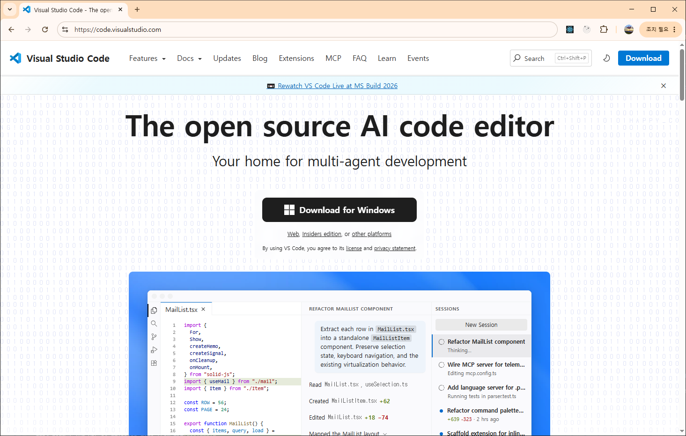

<!-- ## Windows 기준 초기 설정

이번 팀 프로젝트는 Linux 3-Tier 서비스를 Docker Compose 구조로 전환하고 AWS 배포 가능성을 검증하는 프로젝트입니다. VS Code는 `compose.yaml`, `Dockerfile`, `nginx.conf`, `haproxy.cfg`, `.env.example`, User Data 스크립트 같은 설정 파일을 작성하고 확인하는 용도로 사용합니다. -->

<!-- ### VS Code 설치 옵션

Windows 설치 파일을 실행할 때 아래 항목을 선택합니다.

- `Add to PATH`
- `Open with Code` 우클릭 메뉴 추가
- `Register Code as an editor for supported file types` -->

**설치 후 VS Code를 실행하고 `File > Auto Save`는 팀원 취향에 따라 선택합니다. 실습 중에는 저장 누락을 줄이기 위해 켜두는 것을 권장합니다.**

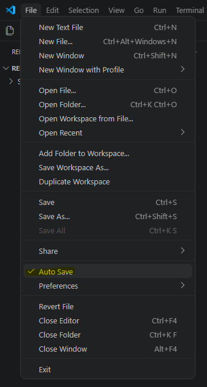

---

### 필수 확장 프로그램

좌측 상단 확장 프로그램 아이콘을 클릭합니다
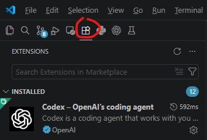

검색창에 확장 프로그램명 또는 Extension ID를 넣어서 찾은 후 확장 프로그램을 설치합니다.

| 확장 프로그램 | Extension ID | 용도 |
| --- | --- | --- |
| [Docker DX](https://marketplace.visualstudio.com/items?itemName=docker.docker) | `docker.docker` | Dockerfile, Compose 파일 작성 지원, 경고 표시, Compose outline 확인 |
| [Remote - SSH](https://marketplace.visualstudio.com/items?itemName=ms-vscode-remote.remote-ssh) | `ms-vscode-remote.remote-ssh` | AWS EC2 서버에 SSH로 접속해서 파일과 설정 확인 |
| [Prettier](https://marketplace.visualstudio.com/items?itemName=esbenp.prettier-vscode) | `esbenp.prettier-vscode` | 코드 포맷터 |

<!-- Docker Compose 파일은 별도 팀 컨벤션을 정하지 않았으므로 Docker DX 기본 설정을 우선 사용합니다. -->

---

<!-- ### 권장 확장 프로그램

필수는 아니지만 작업 편의를 위해 아래 확장을 추가로 설치할 수 있습니다.

| 확장 프로그램 | Extension ID | 용도 |
| --- | --- | --- |
| YAML | `redhat.vscode-yaml` | 일반 YAML 파일 문법 확인과 포맷팅 보조 |
| AWS Toolkit | `amazonwebservices.aws-toolkit-vscode` | AWS 리소스 확인 보조 |
| GitLens | `eamodio.gitlens` | Git 변경 이력 확인 |

권장 확장은 팀 전체 필수는 아닙니다. 발표와 제출물 기준에서는 명령어 실행 결과와 캡처가 더 중요합니다. -->

### VS Code 기본 설정

확장 프로그램 두개를 설치 완료 했으면

`Ctrl` + `Shift` + `P`를 누르고 `Preferences: Open User Settings (JSON)`을 검색해서 선택한 뒤 기존 설정을 지우고 아래 설정을 복붙합니다.

```json
{
  "files.autoSave": "afterDelay",
  "git.confirmSync": false,
  "markdown.updateLinksOnFileMove.enabled": "prompt",
  "workbench.activityBar.location": "top",
  "editor.formatOnSave": true,
  "editor.tabSize": 2,
  "editor.insertSpaces": true,
  "files.eol": "\n",
  "files.trimTrailingWhitespace": true,
  "files.insertFinalNewline": true,
  "terminal.integrated.defaultProfile.windows": "PowerShell"
}
```

<!-- 주의: 기존 설정 파일에 이미 `{ ... }`가 있으면 전체를 새로 붙여넣지 말고 필요한 항목만 추가합니다. JSON 파일은 마지막 항목 뒤에 쉼표를 붙이면 오류가 납니다. -->

<!-- ### 프로젝트 폴더 열기

VS Code에서 `File > Open Folder...`를 선택하고 팀 프로젝트 폴더를 엽니다. Docker Compose 관련 파일은 가능하면 아래 이름을 사용합니다.

- `compose.yaml`
- `Dockerfile`
- `.env.example`
- `nginx/default.conf`
- `haproxy/haproxy.cfg`
- `user-data.sh`

프로젝트 문서에서 코드와 설정 제출물이 중요하므로, 파일 이름과 위치를 팀원끼리 동일하게 맞춥니다. -->

### Windows 터미널에서 설치 확인

VS Code 터미널을 열고(`ctrl` + `shift` + `) 아래 명령어가 실행되는지 확인합니다.

```powershell
code --version
ssh -V
```

나와야 하는 결과 형식 예시는 아래와 같습니다().
```
1.117.0
10c8e557c8b9f9ed0a87f61f1c9a44bde731c409
x64
OpenSSH_for_Windows_9.5p1, LibreSSL 3.8.2
```


```powershell
code --version
git --version
docker --version
docker compose version
ssh -V
```

### SSH 원격 접속 방법

SSH Remote 익스텐션을 설치하면 자동으로 우측 상단 툴바에 아이콘이 생성됩니다. 빨간 동그라미친 SSH Remote 아이콘을 클릭하세요.


SSH 항목 오른쪽에 있는 `+`를 클릭합니다.


그럼 상단 중앙에 아래와 같은 입력창이 뜹니다. 입력창에 원격 접속하고자 하는 VM의 user id 와 ip 주소를 입력 합니다.
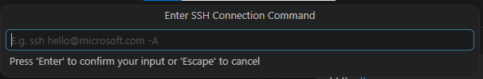

```bash
# 예시
guru@192.168.111.100
```

이후에 ssh 접속 설정을 어디에 저장할건지 묻습니다.
여기서는 `C:\Users\[내계정명]\.ssh\config` 경로에 저장하도록  클릭해 선택합니다.
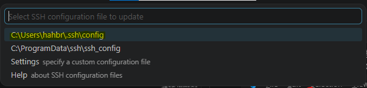


설정 등록에 성공했다면 우측 하단에 아래와 같은 알림이 뜹니다.
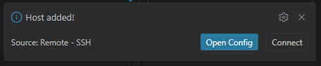

알림의 Open Config 버튼을 클릭하거나 우측상단 SSH Remote 아이콘을 클릭하고 `SSH` 항목을 클릭하면 새로운 원격 설정이 등록된것을 확인 할 수 있습니다.

새로 등록된 설정에서 오른쪽 아이콘을 클릭하여 연결한다. 왼쪽은 `현재창에서 열기` 오른쪽은 `새창에서 열기`입니다. 원하는대로 클릭하면 되는데 여기서는 새창에서 열기를 클릭하겠습니다.

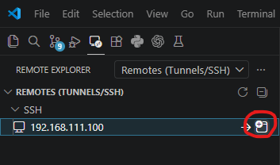


새창으로 열면 최초접속시에는 OS가 뭔지 선택하라는 창이 나온다 Linux 를 클릭합니다.


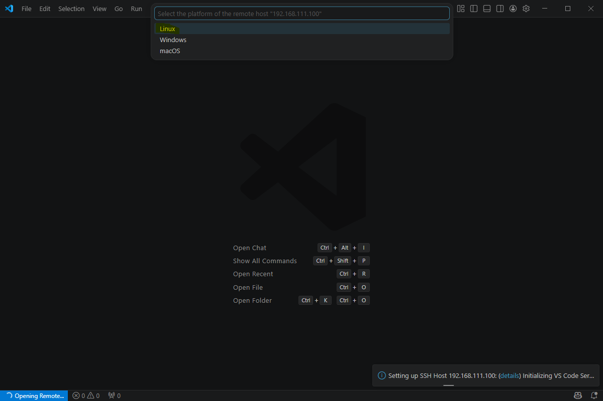


이후 상단 중앙에 원격 접속 비밀번호를 입력하라는 창이 뜹니다.

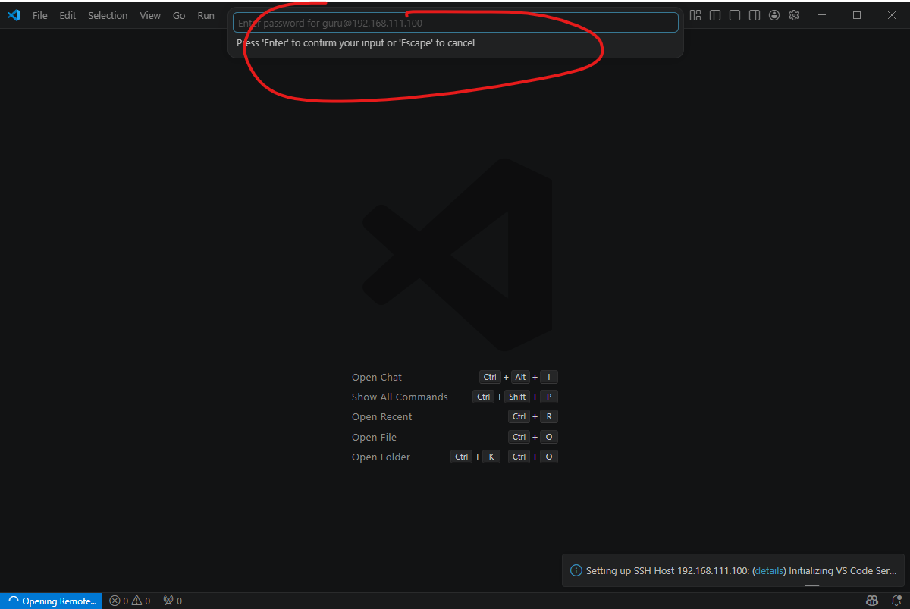

비밀번호를 입력하고 엔터를 누르면 최초접속시 해당 VM에 VScode를 설치 중이라고 우측 하단에 알림이 뜹니다

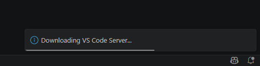

설치가 완료되면 아래 화면으로 넘어가게 됩니다.

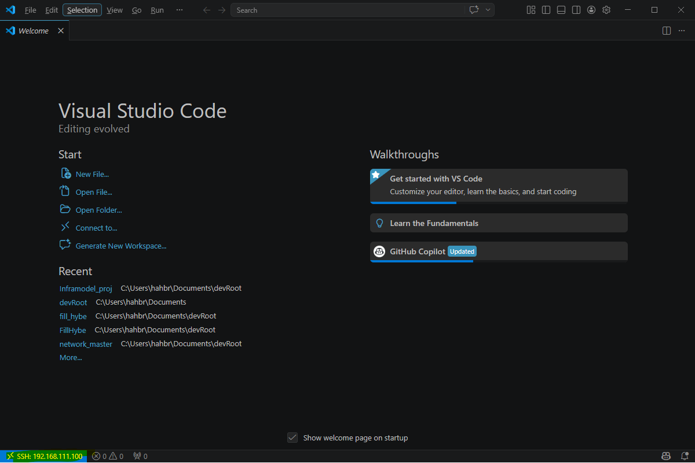

좌측 하단을 보면 192.168.111.100 VM에 잘 접속된 것을 확인 할 수 있습니다.

이후 원격 접속한 VM에도 `Docker DX` 와 `Prettier` 두개의 확장 프로그램을 설치해야합니다. 여기서 방법을 모르면 @하병노 를 불러주세요

---

### Compose 파일 작성 확인

`compose.yaml` 파일을 열었을 때 VS Code 오른쪽 Outline 영역에 services, networks, volumes 같은 항목이 보이면 Docker DX가 정상 동작하는 상태입니다.

작성 후에는 터미널에서 아래 명령어로 Compose 문법을 확인합니다.

```powershell
docker compose config
```

이 명령어가 오류 없이 전체 설정을 출력하면 Compose 파일 문법은 정상입니다.
